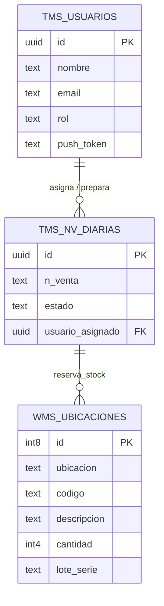

# ⚙️ DOCUMENTACIÓN TÉCNICA OPERATIVA (DEV GUIDE)
**Versión:** 2.0.0
**Contexto:** Guía de arranque rápido, despliegue, y mantenimiento técnico para desarrolladores.

Esta documentación acompaña a `DOCUMENTACION_OFICIAL.md` proporcionando la "capa de hierro" necesaria para compilar, entender la base de datos y depurar el código localmente.

---

## 💻 1. PRE-REQUISITOS DEL ENTORNO

Para ejecutar o contribuir a este proyecto, necesitas instalar en tu máquina local:
1. **Node.js** (v18.0 o superior)
2. **Git** (Para control de versiones)
3. **Android Studio** (Solo si necesitas compilar una nueva APK nativa desde cero)
4. Cuenta activa en **Supabase**, **Firebase** (para Push) y **Capgo** (para OTA).

---

## 🔑 2. VARIABLES DE ENTORNO (`.env`)

En la raíz del proyecto debe existir un archivo `.env` (no trackeado en Git) con las siguientes variables. Sin ellas, la app web y móvil no podrán compilar ni conectarse al Backend.

```env
# [OBLIGATORIAS] - Conexión a la Base de Datos y Auth
VITE_SUPABASE_URL=https://[TU_PROYECTO].supabase.co
VITE_SUPABASE_ANON_KEY=[TU_LLAVE_ANONIMA_AQUI]

# [OPCIONALES] - Solo necesarias si habilitas módulos específicos
VITE_SENTRY_DSN=https://[ID]@o[ID].ingest.sentry.io/[ID]
```
*Nota: Si estás usando el CLI de Capgo para despliegues, asegúrate de haber hecho login localmente con `npx @capgo/cli login`.*

---

## 🚀 3. SCRIPTS DE EJECUCIÓN (NPM SCRIPTS)

Dentro de `package.json`, existen comandos configurados para manejar el ciclo de vida del proyecto:

| Comando | Descripción |
| :--- | :--- |
| `npm run dev` | Inicia el servidor de desarrollo local (Vite) con Hot-Reloading en `http://localhost:5173`. |
| `npm run build` | Compila el proyecto React para producción dentro de la carpeta `dist/`. |
| `npx cap sync android` | Sincroniza la carpeta `dist/` compilada hacia el proyecto de Android Studio. (Requiere build previo). |
| `npm run deploy:mobile`| **[Uso Frecuente]** Compila la web y la sube a Capgo. Actualiza las apps de los celulares en terreno sin usar la Play Store. |
| `npm run start` | Arranca un servidor Node básico (`server.js`) si se despliega en entornos que no soportan estáticos puros. |

**Flujo Diario del Desarrollador:**
```bash
# 1. Bajar últimos cambios
git pull

# 2. Instalar dependencias si hay nuevas
npm install

# 3. Levantar entorno local para programar
npm run dev

# 4. Al terminar un feature, enviar la actualización a los celulares:
npm run deploy:mobile
```

---

## 🗄️ 4. ESQUEMA DE BASE DE DATOS (Supabase PostgreSQL)

A continuación se detallan las tablas Core del sistema. Para ver las políticas RLS, revisa el archivo `database/rls_policies_and_realtime.sql`.

### `tms_usuarios` (Tabla de Personal y Auth)
| Columna | Tipo | Descripción |
| :--- | :--- | :--- |
| `id` | `uuid` (PK) | Relacionado con `auth.users` de Supabase. |
| `nombre` | `text` | Nombre completo del operario. |
| `email` | `text` | Correo de acceso. |
| `rol` | `text` | Nivel de permiso (`ADMIN`, `OPERADOR`, `CONDUCTOR`, etc). |
| `push_token` | `text` | Token de Firebase FCM para enviarle notificaciones. Se auto-actualiza al loguearse. |

### `wms_ubicaciones` (Inventario de Bodega)
| Columna | Tipo | Descripción |
| :--- | :--- | :--- |
| `id` | `int8` (PK) | Identificador único del registro de ubicación. |
| `ubicacion` | `text` | Coordenada física (ej: "A-12-B"). |
| `codigo` | `text` | SKU del producto. |
| `descripcion` | `text` | Nombre comercial del producto. |
| `cantidad` | `int4` | Stock físico en esa posición exacta. |
| `lote` / `serie` | `text` | Trazabilidad del producto en esa posición. |

### `tms_nv_diarias` (Órdenes / Notas de Venta a procesar)
| Columna | Tipo | Descripción |
| :--- | :--- | :--- |
| `id` | `uuid` (PK) | Identificador de la orden. |
| `n_venta` | `text` | Número de documento comercial. |
| `estado` | `text` | Fase actual (`PENDIENTE`, `EN PICKING`, `DESPACHADO`). |
| `usuario_asignado`| `uuid` (FK) | Relación a `tms_usuarios.id`. Define quién arma el pedido. **(Dispara Push Notifications)**. |

---

## 🔌 5. CONTRATOS DE API (Custom Hooks y Supabase RPC)

La capa de datos se maneja a través de **TanStack Query** para garantizar caché y sincronización offline.

### 🔄 Movimiento de Stock (Carga Optimista)
Ubicación: `src/services/inventoryService.js` (Hook: `useMoveStock`)

Para mover inventario de una ubicación a otra garantizando atomicidad en la Base de Datos, se llama a una función RPC de PostgreSQL (`move_stock`).

**Payload requerido:**
```javascript
const moveStockMutation = useMoveStock();

// Ejecución
moveStockMutation.mutate({
  sku: 'PRD-123',
  fromLoc: 'A-01',
  toLoc: 'B-02',
  qty: 50,
  batch: 'LOTE-001', // Requerido para productos con trazabilidad
  userId: 'uuid-del-operador', // Para logs de auditoría
  reason: 'Reabastecimiento manual' // Motivo del movimiento
});
```
*Si falla la conexión, la UI muestra éxito inmediatamente, y el Hook encola la petición en Dexie.js (IndexedDB).*

### 🔔 Envío de Notificaciones Push Nativas
Las notificaciones son disparadas desde el Backend a través de Edge Functions.
*   **Trigger SQL:** `database/push_trigger.sql` intercepta los `UPDATE` en la columna `usuario_asignado` de `tms_nv_diarias`.
*   **Edge Function:** `supabase/functions/send-push/index.ts` toma el Token del usuario asignado y se comunica con la API de Firebase.

---

## 📱 6. GUÍA DE COMPILACIÓN NATIVA (ANDROID STUDIO)

Si necesitas instalar el entorno móvil desde cero en un celular nuevo o hacer cambios a nivel de hardware (plugins de Capacitor):

1. Compila la app web primero:
   ```bash
   npm run build
   ```
2. Sincroniza los archivos web hacia la carpeta nativa de Android:
   ```bash
   npx cap sync android
   ```
3. Abre el proyecto en Android Studio:
   ```bash
   npx cap open android
   ```
4. Dentro de Android Studio, espera a que finalice la sincronización de Gradle.
5. Selecciona el dispositivo conectado (USB o Emulador) y presiona **Run (▶️)** o ve a **Build > Build Bundle(s) / APK(s) > Build APK(s)**.

**IMPORTANTE:** El archivo `android/app/google-services.json` DEBE existir antes de compilar, de lo contrario las notificaciones Push de Firebase causarán un crash al iniciar la app.


## 📊 7. DIAGRAMA ENTIDAD-RELACIÓN (ER)

El siguiente diagrama muestra las relaciones principales entre las entidades del núcleo de la base de datos. (Soportado nativamente por Markdown en GitHub/GitLab).



---

## 🔐 8. MATRIZ DE ROLES Y PERMISOS (RBAC)

El acceso a los módulos y las operaciones de escritura/eliminación están gobernados por el campo `rol` en `tms_usuarios`.

| Módulo / Acción | `ADMIN` | `SUPERVISOR` | `OPERADOR` | `CONDUCTOR` |
| :--- | :---: | :---: | :---: | :---: |
| **Acceso Inbound/Outbound** | ✅ | ✅ | ✅ | ❌ |
| **Mover Inventario (App)** | ✅ | ✅ | ✅ | ❌ |
| **Consultas y Kardex** | ✅ | ✅ | ✅ | ❌ |
| **Asignar Tareas a Otros** | ✅ | ✅ | ❌ | ❌ |
| **Eliminar Ubicaciones** | ✅ | ❌ | ❌ | ❌ |
| **Gestión TMS (Transporte)** | ✅ | ✅ | ❌ | ✅ |
| **Gestión de Usuarios (Admin)** | ✅ | ❌ | ❌ | ❌ |

---

## 🧰 9. LISTADO DE CUSTOM HOOKS Y SERVICIOS

El código está modularizado para separar la lógica de UI de la lógica de negocio y peticiones.

### 📁 `src/services/` (Capa de Lógica de Negocio y Datos)
*   **`inventoryService.js`**: Contiene las mutaciones (TanStack Query) y llamadas RPC a Supabase (`useMoveStock`, `useInventoryQueries`). También maneja el guardado en Dexie.js para el modo Offline.
*   **`mobileService.js`**: Controla el ciclo de vida móvil. Inicializa las actualizaciones OTA de Capgo, gestiona los listeners de red (`online`/`offline`) y registra el dispositivo en FCM para Push.
*   **`labelPrinter.js`**: Lógica de generación e impresión de etiquetas ZPL/PDF para Farmapack y cajas de despacho.
*   **`wmsLogic.js`**: Funciones puras para validación de formatos de códigos de barras, cálculos de cubicaje (L x W x H) y lógicas de validación.
*   **`stressTest.js`**: Utilidad de pruebas de carga para inyectar transacciones concurrentes simuladas.

### 📁 `src/hooks/` (Capa Reactiva de UI y Sensores)
*   **`useScanner.js`**: Hook global que intercepta eventos del teclado. Diferencia si escribe un humano o un láser PDA midiendo el tiempo entre pulsaciones (< 30ms).
*   **`usePresence.js`**: Conecta con Supabase Realtime Channels. Retorna un array con los usuarios conectados en la misma `room` (Modo Multijugador).
*   **`usePushNotifications.js`**: Hook base para envolver las peticiones de permisos de Capacitor Push Notifications.
*   **`useConductores.js`**: Lógica de fetching de estados para los choferes del TMS.

---

## 🚑 10. GUÍA DE TROUBLESHOOTING (Errores Comunes)

Si el proyecto presenta fallos durante el desarrollo o despliegue, revisa esta tabla antes de escalar el problema.

| Error / Síntoma | Causa Principal | Solución Rápida |
| :--- | :--- | :--- |
| `❌ Version X.X.X already exists` al usar `deploy:mobile` | Capgo no permite sobrescribir la misma versión OTA. | Abre `package.json` y aumenta el campo `version` (ej: de `1.0.1` a `1.0.2`). Luego vuelve a ejecutar el comando. |
| `relation "public.X" does not exist` en Supabase SQL | El nombre de la tabla en el Trigger o consulta no existe. | Verifica en el Table Editor de Supabase el nombre real. (ej: Usar `tms_nv_diarias` en lugar de `tms_tareas_picking`). |
| `22P02: invalid input syntax for type uuid: "16"` | Estás intentando buscar/actualizar un registro pasando un ID numérico en una columna tipo UUID. | Copia el UUID completo (ej: `57ad329d-b44c-...`) desde Supabase y pásalo como string. |
| **La app en el celular no muestra los cambios tras hacer deploy OTA** | El caché interno de Capgo se quedó "atrapado" en la versión vieja. | En Android: Ajustes > Aplicaciones > WMS CCO > Almacenamiento y Caché > **Borrar Almacenamiento**. Abre la app de nuevo. |
| **Push Notifications no vibran en Android** | Permisos denegados a nivel Sistema Operativo o falta el archivo de Google. | 1) Verifica que `android/app/google-services.json` exista.<br>2) En el celular, ve a Ajustes > Apps > WMS CCO > Notificaciones y actívalas. |
| `El token '&&' no es un separador de instrucciones válido` | Estás usando PowerShell para correr comandos encadenados (ej: `npm run build && npx cap sync`). | En PowerShell debes usar `;` en lugar de `&&`. (ej: `npm run build; npx cap sync android`). |

---
*Fin del Documento Técnico.*
