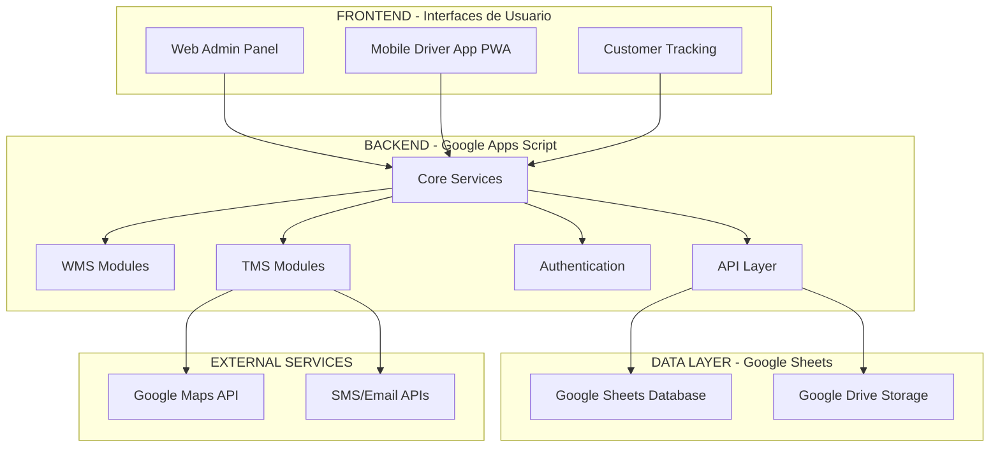

# FLUJO COMPLETO DEL PROYECTO WMS + TMS

## 📋 RESUMEN EJECUTIVO

Sistema integrado de gestión de almacén (WMS) y transporte (TMS) desarrollado en Google Apps Script, que maneja el flujo completo desde la recepción de mercancía hasta la entrega final al cliente.

## 🏗️ ARQUITECTURA GENERAL DEL SISTEMA



## 🔄 FLUJO OPERACIONAL COMPLETO

### FASE 1: GESTIÓN DE ALMACÉN (WMS)

#### 1.1 RECEPCIÓN DE MERCANCÍA
```
📦 Llegada de Mercancía
    ↓
🔍 Inspección y Verificación
    ↓
📝 Registro en Sistema (Reception.gs)
    ↓
🏷️ Generación de Etiquetas
    ↓
📍 Asignación de Ubicaciones (Layout.gs)
    ↓
💾 Actualización de Inventario
```

**Archivos Involucrados:**
- `Reception.gs` - Lógica de recepción
- `Reception_Page.html` - Interfaz de recepción
- `Layout.gs` - Gestión de ubicaciones
- `Inventory.gs` - Control de inventario

#### 1.2 GESTIÓN DE INVENTARIO
```
📊 Consulta de Stock
    ↓
🔄 Movimientos de Inventario
    ↓
📈 Reportes de Rotación
    ↓
⚠️ Alertas de Stock Mínimo
    ↓
🔄 Reabastecimiento
```

**Archivos Involucrados:**
- `Inventory.gs` - Gestión de inventario
- `Inventory_Page.html` - Interfaz de inventario
- `Reports.gs` - Generación de reportes

#### 1.3 GESTIÓN DE LOTES Y SERIES
```
🏷️ Ingreso de Productos con Lotes
    ↓
📝 Registro de Números de Serie
    ↓
🔍 Trazabilidad Completa
    ↓
📊 Control de Vencimientos
    ↓
📋 Reportes de Trazabilidad
```

**Archivos Involucrados:**
- `LotesSeries.gs` - Lógica de lotes y series
- `LotesSeries_Page.html` - Interfaz principal
- `LotesSeries_Logic.html` - Lógica de frontend
- `LotesSeries_Galaxy.html` - Componentes visuales

### FASE 2: PROCESAMIENTO DE ÓRDENES

#### 2.1 GESTIÓN DE NOTAS DE VENTA
```
📄 Carga de Notas de Venta (Excel)
    ↓
✅ Validación de Datos
    ↓
💾 Almacenamiento en Sistema
    ↓
📋 Generación de Órdenes de Picking
    ↓
🎯 Asignación de Prioridades
```

**Archivos Involucrados:**
- `NotasVenta.gs` - Procesamiento de N.V.
- `NotasVenta_Page.html` - Interfaz de N.V.
- `ExcelUpload.gs` - Carga masiva de Excel

#### 2.2 PROCESO DE PICKING
```
📋 Orden de Picking Generada
    ↓
👤 Asignación a Operario
    ↓
📍 Optimización de Ruta de Picking
    ↓
📦 Recolección de Productos
    ↓
✅ Verificación y Confirmación
    ↓
📊 Actualización de Estados
```

**Archivos Involucrados:**
- `Picking.gs` - Lógica principal de picking
- `PickingEnhanced.gs` - Funcionalidades avanzadas
- `PickingAPI.gs` - API de picking
- `PickingRealTime.gs` - Actualizaciones en tiempo real
- `PickingEstados.gs` - Gestión de estados
- `PickingUbicaciones.gs` - Manejo de ubicaciones
- `PickingObservaciones.gs` - Sistema de observaciones
- `Picking_Page.html` - Interfaz de picking

#### 2.3 PROCESO DE PACKING
```
📦 Productos Pickeados
    ↓
📋 Verificación de Completitud
    ↓
📦 Empaquetado
    ↓
🏷️ Etiquetado de Envío
    ↓
⚖️ Pesaje y Dimensionado
    ↓
📊 Registro de Paquete
```

**Archivos Involucrados:**
- `Packing.gs` - Lógica de empaquetado
- `PackingEnhanced.gs` - Funcionalidades avanzadas
- `PackingLog.gs` - Registro de actividades
- `Packing_Page.html` - Interfaz de packing

### FASE 3: DESPACHO Y PREPARACIÓN PARA TRANSPORTE

#### 3.1 PROCESO DE DESPACHO
```
📦 Paquetes Listos
    ↓
📋 Consolidación de Envíos
    ↓
🚚 Asignación a Rutas de Transporte
    ↓
📄 Generación de Documentos
    ↓
✅ Confirmación de Despacho
```

**Archivos Involucrados:**
- `Dispatch.gs` - Lógica de despacho
- `Dispatch_Page.html` - Interfaz de despacho
- `Shipping.gs` - Gestión de envíos
- `Shipping_Page.html` - Interfaz de envíos

### FASE 4: GESTIÓN DE TRANSPORTE (TMS)

#### 4.1 PLANIFICACIÓN DE RUTAS
```
📋 Órdenes de Entrega Recibidas
    ↓
🗺️ Análisis Geográfico
    ↓
🤖 Optimización Automática de Rutas
    ↓
👤 Asignación de Conductores
    ↓
🚚 Asignación de Vehículos
    ↓
📱 Envío a App Móvil
```

**Archivos Involucrados:**
- `TMSRoutePlanning.gs` - Planificación de rutas
- `TMSOptimization.gs` - Algoritmos de optimización
- `TMS_RoutePlanning_Page.html` - Interfaz de planificación

**Algoritmos de Optimización:**
- Nearest Neighbor (Vecino más cercano)
- Zone-based (Por zonas geográficas)
- Time Window (Por ventanas de tiempo)
- Priority First (Por prioridad)

#### 4.2 GESTIÓN DE CONDUCTORES
```
👤 Registro de Conductores
    ↓
🚚 Asignación de Vehículos
    ↓
📱 Distribución de Rutas
    ↓
📍 Seguimiento en Tiempo Real
    ↓
📊 Evaluación de Rendimiento
```

**Archivos Involucrados:**
- `TMSDrivers.gs` - Gestión de conductores
- `TMS_Drivers_Page.html` - Interfaz de conductores

#### 4.3 TORRE DE CONTROL
```
🗺️ Mapa en Tiempo Real
    ↓
📍 Ubicación de Conductores
    ↓
📊 Estado de Entregas
    ↓
⚠️ Alertas y Notificaciones
    ↓
📞 Comunicación Directa
```

**Archivos Involucrados:**
- `TMSControlTower.gs` - Torre de control
- `TMS_ControlTower_Page.html` - Interfaz de monitoreo

### FASE 5: EJECUCIÓN DE ENTREGAS

#### 5.1 APLICACIÓN MÓVIL DEL CONDUCTOR
```
📱 Recepción de Ruta
    ↓
🗺️ Navegación GPS
    ↓
📍 Llegada a Destino
    ↓
📦 Proceso de Entrega
    ↓
📸 Captura de POD (Proof of Delivery)
    ↓
✅ Confirmación de Entrega
```

**Archivos Involucrados:**
- `TMSMobileApp.gs` - App móvil principal
- `TMS_Mobile_Index.html` - Interfaz principal móvil
- `TMS_Mobile_Tasks.html` - Lista de tareas
- `TMS_Mobile_Navigation.html` - Navegación
- `TMSCamera.gs` - Captura de fotos
- `TMSOffline.gs` - Funcionalidad offline

#### 5.2 SEGUIMIENTO PARA CLIENTES
```
🔗 Link de Seguimiento
    ↓
📍 Estado en Tiempo Real
    ↓
⏰ Tiempo Estimado de Llegada
    ↓
📱 Notificaciones Automáticas
    ↓
✅ Confirmación de Entrega
```

**Archivos Involucrados:**
- `TMSTracking.gs` - Seguimiento en tiempo real
- Interfaz pública de tracking

## 🔧 COMPONENTES TÉCNICOS PRINCIPALES

### AUTENTICACIÓN Y SEGURIDAD
```
🔐 Sistema de Login
    ↓
👤 Gestión de Usuarios
    ↓
🛡️ Control de Permisos por Rol
    ↓
📊 Auditoría de Acciones
```

**Archivos Involucrados:**
- `Auth.gs` - Sistema de autenticación
- `Roles.gs` - Gestión de roles
- `UserManagement.gs` - Gestión de usuarios
- `FIX_LOGIN_PERMISOS.gs` - Correcciones de permisos

### SISTEMA DE ENTREGAS MEJORADO
```
📱 Interfaz Mobile-First
    ↓
🔄 Actualizaciones en Tiempo Real
    ↓
📸 Captura de Fotos Optimizada
    ↓
💾 Funcionalidad Offline
    ↓
🎨 Animaciones y UX Mejorada
```

**Archivos Involucrados:**
- `Delivery.gs` - Lógica de entregas
- `DeliveryLog.gs` - Registro de entregas
- `Delivery_Page.html` - Interfaz de entregas
- `EstadosManager.gs` - Gestión de estados
- `DriveManager.gs` - Gestión de archivos

### COMPONENTES DE DISEÑO
```
🎨 Sistema de Diseño Unificado
    ↓
📱 Componentes Responsivos
    ↓
✨ Animaciones CSS
    ↓
🎯 Experiencia de Usuario Optimizada
```

**Archivos Involucrados:**
- `WMS_Design_System.html` - Sistema de diseño
- `WMS_Components.html` - Componentes reutilizables
- `WMS_Components_JS.html` - Lógica de componentes
- `WMS_Animations.html` - Animaciones

## 📊 FLUJO DE DATOS

### ESTRUCTURA DE DATOS EN GOOGLE SHEETS

#### Hojas WMS:
- **Inventario**: Stock, ubicaciones, movimientos
- **Productos**: Catálogo, especificaciones, precios
- **Lotes_Series**: Trazabilidad completa
- **Picking**: Órdenes y estados de picking
- **Packing**: Registro de empaquetado
- **Despachos**: Control de salidas

#### Hojas TMS:
- **Entregas**: Órdenes de entrega y estados
- **Conductores**: Información de conductores
- **Rutas**: Planificación y optimización
- **Vehículos**: Flota y capacidades
- **Tracking**: Seguimiento en tiempo real

### INTEGRACIÓN DE DATOS
```
WMS (Despacho) → TMS (Entregas)
    ↓
Optimización de Rutas
    ↓
Asignación a Conductores
    ↓
Ejecución de Entregas
    ↓
Actualización de Estados
    ↓
Confirmación de Entrega
```

## 🚀 FUNCIONALIDADES AVANZADAS

### OPTIMIZACIÓN INTELIGENTE
- **Algoritmos de Ruteo**: 4 algoritmos diferentes
- **Consideración de Tráfico**: Integración con Google Maps
- **Optimización por Zonas**: Agrupación geográfica inteligente
- **Ventanas de Tiempo**: Respeto a horarios preferenciales

### TIEMPO REAL
- **Actualizaciones Live**: Polling adaptativo
- **Notificaciones Push**: Alertas automáticas
- **Sincronización Offline**: Funcionalidad sin conexión
- **Estados Dinámicos**: Cambios instantáneos

### ANÁLISIS Y REPORTES
- **Métricas de Rendimiento**: KPIs en tiempo real
- **Análisis de Eficiencia**: Comparativas y tendencias
- **Reportes Automáticos**: Generación programada
- **Dashboard Ejecutivo**: Vista consolidada

## 🔄 ESTADOS Y TRANSICIONES

### Estados WMS:
```
RECIBIDO → ALMACENADO → PICKING → PACKED → DESPACHADO
```

### Estados TMS:
```
PENDIENTE → ASIGNADO → EN_RUTA → EN_DESTINO → ENTREGADO/RECHAZADO
```

### Flujo Integrado:
```
WMS: DESPACHADO → TMS: PENDIENTE
TMS: ASIGNADO → Conductor: NOTIFICADO
TMS: EN_RUTA → Cliente: NOTIFICADO
TMS: ENTREGADO → WMS: COMPLETADO
```

## 📱 INTERFACES DE USUARIO

### Web Admin Panel:
- **Dashboard Unificado**: Vista general del sistema
- **Módulos WMS**: Gestión completa de almacén
- **Módulos TMS**: Planificación y seguimiento
- **Reportes**: Análisis y métricas
- **Configuración**: Usuarios y permisos

### Mobile Driver App (PWA):
- **Lista de Tareas**: Entregas asignadas
- **Navegación GPS**: Integración con mapas
- **Captura de POD**: Fotos de confirmación
- **Estado Offline**: Funcionalidad sin conexión
- **Comunicación**: Chat con despachador

### Customer Tracking:
- **Seguimiento Público**: Estado de pedido
- **Notificaciones**: SMS y email automáticos
- **ETA Dinámico**: Tiempo estimado actualizado
- **Historial**: Registro completo de eventos

## 🔧 CONFIGURACIÓN Y DEPLOYMENT

### Requisitos Técnicos:
- Google Apps Script
- Google Sheets como base de datos
- Google Drive para almacenamiento
- Google Maps API para navegación
- APIs de notificaciones (SMS/Email)

### Proceso de Instalación:
1. **Setup Inicial**: `setupTMSSpreadsheet()`
2. **Inicialización**: `initializeTMS()`
3. **Configuración de Permisos**: Roles y usuarios
4. **Integración de APIs**: Maps, notificaciones
5. **Testing**: Pruebas de funcionalidad
6. **Go-Live**: Puesta en producción

## 📈 MÉTRICAS Y KPIs

### WMS KPIs:
- Tiempo promedio de picking
- Precisión de inventario
- Rotación de productos
- Eficiencia de almacenamiento

### TMS KPIs:
- Tiempo promedio de entrega
- Eficiencia de rutas
- Satisfacción del cliente
- Utilización de flota

### KPIs Integrados:
- Tiempo total orden-entrega
- Costo por entrega
- Tasa de entregas exitosas
- Productividad general

## 🔮 ROADMAP Y MEJORAS FUTURAS

### Próximas Funcionalidades:
- **IA Predictiva**: Predicción de demanda
- **IoT Integration**: Sensores de temperatura/ubicación
- **Blockchain**: Trazabilidad inmutable
- **Analytics Avanzados**: Machine Learning

### Optimizaciones Técnicas:
- **Performance**: Optimización de consultas
- **Escalabilidad**: Arquitectura distribuida
- **Security**: Encriptación avanzada
- **UX/UI**: Mejoras continuas de interfaz

---

## 📞 SOPORTE Y MANTENIMIENTO

Este documento representa el estado actual del sistema WMS+TMS integrado. Para actualizaciones, consultas técnicas o soporte, referirse a la documentación específica de cada módulo en los archivos correspondientes.

**Última actualización**: Febrero 2026
**Versión del sistema**: 2.0
**Autor**: Sistema CCO