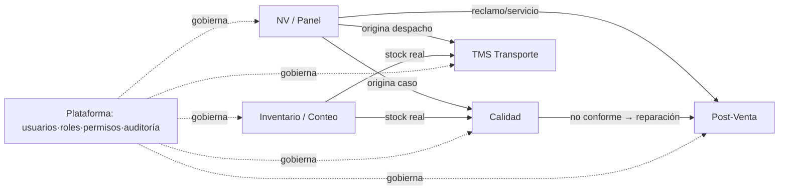
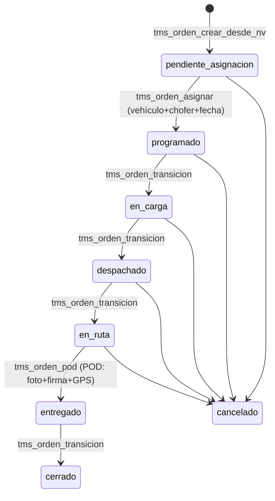
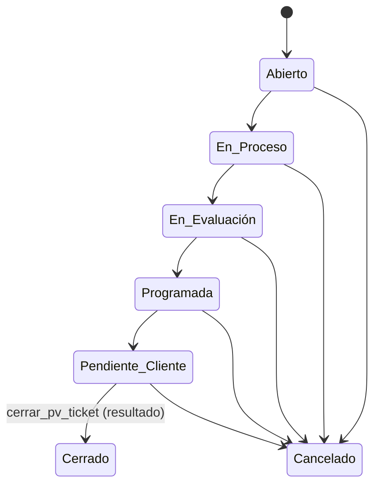
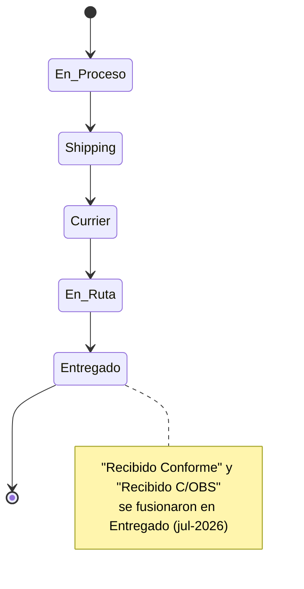
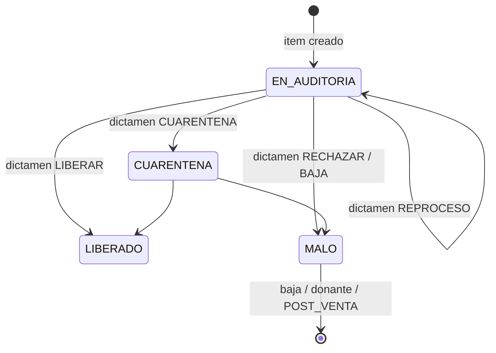

# Arquitectura CCO — Los 5 Pilares

> **Propósito.** Convertir el *plano maestro* (vista ejecutiva del flujo, en
> `docs/flujo-maestro-cco.json`) en una **arquitectura de software**: entidades,
> máquinas de estado, eventos de dominio, permisos por transición y contratos de
> servicio. No agrega procesos nuevos; **formaliza lo que ya existe** en el
> código y la BD, marca la **deuda** y fija el **objetivo** para evolucionar CCO
> de "pantallas conectadas" a **plataforma modular**.
>
> Anclado a la realidad del repo (Supabase `vtrtyzbgpsvqwbfoudaf`, ~80 tablas).
> Cada afirmación tiene su fuente en código/migración. Fecha: 2026-07-18.

Convenciones: **Hoy** = lo implementado. **Deuda** = gap real detectado.
**Objetivo** = a dónde llevarlo. Nada de "Objetivo" se aplica sin una migración/PR
explícito.

---

## Índice
1. [Mapa de dominios (bounded contexts)](#0-mapa-de-dominios)
2. [Pilar 1 — Entidades](#pilar-1--entidades)
3. [Pilar 2 — Máquinas de estado](#pilar-2--máquinas-de-estado)
4. [Pilar 3 — Eventos de dominio](#pilar-3--eventos-de-dominio)
5. [Pilar 4 — Permisos por rol y por transición](#pilar-4--permisos-por-rol-y-por-transición)
6. [Pilar 5 — APIs y servicios (contratos, sin acoplar)](#pilar-5--apis-y-servicios)
7. [Deuda arquitectónica priorizada](#deuda-arquitectónica-priorizada)
8. [Hoja de ruta sugerida](#hoja-de-ruta-sugerida)

---

## 0. Mapa de dominios

CCO es un **monolito modular** sobre Supabase. Cada dominio ("bounded context")
es dueño de sus tablas, sus estados y sus RPCs de escritura. Los demás dominios
**leen** vistas/RPCs pero **no escriben** en tablas ajenas. Ese es el principio
que evita el acoplamiento.

| Dominio | Núcleo | Tablas raíz | Servicio | Escritura (RPC) |
|---|---|---|---|---|
| **NV / Panel** | Nota de Venta y su ciclo comercial-logístico | `tms_operaciones` | `Panel/ingresar/ingresarService.js`, `Panel/panelService.js` | `guardar_nv`, `cambiar_estado_nv`, `eliminar_nv` |
| **Calidad** | Monitoreo, dictamen, acciones, certificados | `tms_monitoreo_informes/items`, `tms_calidad_tareas/asignaciones/acciones` | `calidadService.js` | `monitoreo_dictaminar`, `crear_accion_calidad`, `firmar_certificado`… |
| **Inventario / Conteo** | Stock, conteo cíclico, análisis de códigos, insumos | `tms_partidas/series`, `tms_conteo_*`, `tms_inventario_general`, `tms_insumos` | `conteoService.js`, `analisisService.js`, `insumosService.js` | `registrar_conteo`, `insumos_*`, `bulk_upsert` |
| **TMS Transporte** | Transporte propio: OT, asignación, ruta, POD | `tms_transporte_ordenes`, `tms_vehiculos`, `tms_conductores`, `tms_transporte_incidencias` | `tmsService.js` | `tms_orden_*`, `tms_incidencia_*` |
| **Post-Venta** | Tickets de servicio técnico, correos, agenda | `tms_postventa_tickets`, `tms_postventa_correos`, `tms_postventa_tecnicos` | `postventaService.js` | `crear/actualizar/avanzar/cerrar_pv_ticket`, `ingesta_pv_correo` |
| **Plataforma** | Usuarios, roles, permisos, vistas, auditoría, OTA | `tms_usuarios`, `tms_roles`, `tms_permisos`, `tms_roles_permisos`, `tms_auditoria`, `tms_modules_config` | `AuthContext`, `ConfigContext`, `otaDeployService.js` | `manage_users/roles/views`, `clean_operational_data` |

> **Regla de oro (objetivo):** el borde entre dominios es **siempre** una RPC o
> una vista de lectura, nunca un `INSERT/UPDATE` directo a la tabla de otro
> dominio. Hoy se cumple para escrituras (cada RPC valida su propio gate); la
> parte por cerrar es que esos cruces sean **eventos**, no llamadas manuales
> (ver Pilar 3 y la deuda N.V.→TMS).

---

## Pilar 1 — Entidades

Modelo de datos por agregado. Se listan las tablas raíz y sus relaciones
**reales** (FKs verificadas en `information_schema`). ⚠️ marca **referencia
blanda** (columna que apunta a otra tabla **sin** constraint FK) — deuda a cerrar.

### 1.1 NV / Panel — agregado `Operación`
`tms_operaciones` (42 columnas) es el registro maestro de la Nota de Venta:
identificadores multi-empresa (`nv_ptm`, `nv_orange`, `nv_farmapack`, `varios`),
`cliente`, `vendedor`, `transportista`, `tipo_despacho`, `division`, `estado`,
`urgente`, y **sellos de fecha por etapa** (`fecha_en_proceso/shipping/en_ruta/
entregado`, `fecha_aprobacion_real`, `fecha_compromiso`…).

- `tms_operaciones.estado` → **FK** `tms_operaciones_estado_cat(estado)` (catálogo).
- `tms_operaciones_log` — bitácora append-only (soft-ref a `oper_id`).
- `tms_consolidados` / `tms_consolidado_nvs` — agrupación para carga masiva.

### 1.2 Calidad — agregado `Informe de Monitoreo`
- `tms_monitoreo_informes` (1) → **FK** `tms_monitoreo_items.informe_id` (N).
- `tms_calidad_acciones.item_id` → **FK** `tms_monitoreo_items.id`; `.area_responsable` → **FK** `tms_areas_calidad.codigo`.
- `tms_calidad_asignaciones.informe_id` → **FK** `tms_monitoreo_informes.id`.
- `tms_calidad_tareas` (checklist ingreso / certificado salida), `tms_calidad_flags` (estado por producto), `tms_monitoreo_evidencias` (fotos, bucket privado `monitoreo-evidencias`).

### 1.3 Inventario / Conteo
- **Stock:** `tms_partidas`, `tms_series` (fuente de verdad de existencias).
- **Conteo:** `tms_conteo_sesiones` (1) → **FK** `tms_conteos.sesion_id` (N). Bloques QR: `tms_conteo_bloques` (1) → **FK** `tms_conteo_bloque_items` y `tms_conteo_auditorias.bloque_id`; auditorías (1) → **FK** `tms_conteo_auditoria_items.auditoria_id`. Proyecciones: `tms_conteo_proyecciones`.
- **Análisis / catálogos:** `tms_inventario_general`, `tms_productos_activo`, `tms_matriz_codigos`.
- **Insumos:** `tms_insumos` (semáforo de embalaje).

### 1.4 TMS Transporte — agregado `Orden de Transporte`
- `tms_transporte_ordenes` (26 col): `folio` (OT-AAAA-####), `estado`, POD (`recibido_por`, `pod_foto_path`, `pod_firma_path`, `fecha_*`).
  - `vehiculo_id` → **FK** `tms_vehiculos.id`. ✅
  - `conductor_id` → ⚠️ **sin FK** a `tms_conductores.id` (uuid, ref blanda).
  - `ruta_id` → ⚠️ **sin FK** a `tms_rutas.id`.
  - `oper_id` → ⚠️ **sin FK** a `tms_operaciones.id` (el puente con la N.V. es lógico, no declarado).
- `tms_transporte_incidencias.orden_id` → **FK** `tms_transporte_ordenes.id`. ✅
- `tms_conductores.user_id` → **FK** `tms_usuarios.id` (puente app del chofer). ✅
- `tms_rutas.conductor_id` → **FK** `tms_conductores.id`. ✅

### 1.5 Post-Venta — agregado `Ticket`
- `tms_postventa_tickets` (33 col): `folio` (TKT-AAAA-###), `estado`, `resultado`, `conversation_id` (hilo = caso), agenda (`fecha_programada`, `hora_programada`), `comuna`/región, equipo/modelo.
- `tms_postventa_correos.ticket_id` → **FK** `tms_postventa_tickets.id` (hilo de correos).
- `tms_postventa_historial.ticket_id` → **FK** `tms_postventa_tickets.id` (bitácora de estados).
- `tms_postventa_tecnicos` (catálogo editable).

### 1.6 Plataforma — RBAC y gobierno
- `tms_usuarios` (`auth_uid` = `auth.uid()`, `rol`, `es_admin_delegado`, `activo`).
- `tms_roles` (N) ←→ (N) `tms_permisos` vía `tms_roles_permisos` (**FK** ambos lados). ✅
- `tms_auditoria` (auditoría genérica de `tms_usuarios`/`tms_roles`).
- `tms_modules_config` (qué módulos existen en Vistas), `tms_notificaciones`, `tms_ota_despliegues`.

> **Deuda de integridad (P1):** declarar las 3 FKs blandas de TMS
> (`conductor_id`, `ruta_id`, `oper_id`). Sin ellas, un `DELETE` de conductor o
> N.V. deja órdenes huérfanas y el modelo no es auto-descriptivo.

---

## Pilar 2 — Máquinas de estado

Una máquina de estado por proceso: **estados**, **transiciones válidas** y **quién
las dispara**. Clave del diseño: la transición debe validarse **en el servidor
(RPC)**, no solo en la UI.

### 2.1 TMS Transporte — máquina **explícita y enforced** ✅ (referencia a imitar)
Fuente: `tmsService.js:10-28`, RPCs `tms_orden_*` en migraciones 104/107.

Disparador: `manage_tms`/`manage_panel`/admin (gate `_tms_puede_gestionar`). El
POD lo captura el chofer desde **Mi Ruta** (`/tms/pda`). Este es el patrón
**objetivo** para todos los dominios: estados finitos + transición server-side +
sello de fecha por hito.

### 2.2 Post-Venta — máquina **lineal enforced** ✅
Fuente: `postventaService.js:23-46`, `avanzar_pv_ticket` en `074:76-93` (usa
`array_position`; error si el estado no está en el flujo o ya es el último).

`resultado` al cerrar ∈ {Resuelto, Parcialmente Resuelto, No Resuelto, Derivado,
Cancelado}. ⚠️ **Fuga:** `actualizar_pv_ticket` (046:175) permite editar `estado`
libre **sin** pasar por `avanzar_pv_ticket` → puede saltarse la máquina. **Deuda:**
restringir edición libre de `estado` o encaminarla por la máquina.

### 2.3 N.V. / Panel — estados **sin transición enforced** ⚠️ (mayor deuda)
Fuente: `Panel/ingresar/estados.js`. El catálogo canónico vive en **JS**, y
`cambiar_estado_nv` (085:83-100) acepta **cualquier string**; el trigger solo
**normaliza** y **sella fechas** en la primera entrada a cada etapa (085:43-71).

Disparador: `manage_panel`/admin (`_panel_puede_escribir`). **Deuda:** no hay
catálogo enforced ni validación de transición en BD; el orden es una convención
de la UI. **Objetivo:** mover el catálogo a `tms_operaciones_estado_cat` (que ya
existe como FK) con `orden`/`siguiente`, y validar la transición dentro de
`cambiar_estado_nv`.

### 2.4 Calidad — máquina **por dictamen** (bifurca) ✅ parcial
Fuente: `calidadService.js:12-35`. El dictamen decide el estado del flag de
producto:

Sub-máquinas paralelas: **tareas** (checklist ingreso, certificado salida) con
`PENDIENTE → EN_PROCESO → CONFORME | NO_CONFORME` (`calidadService.js:490-495`);
**asignaciones** y **acciones** con `PENDIENTE → EN_PROCESO → RESUELTA | ANULADA`.
Disparador: `manage_quality` (dictamen), asserts de calidad para el resto.

### 2.5 Conteo Cíclico — sesión + reconciliación
Sesión: `abierta ⇄ cerrada` (`cerrar_conteo_sesion(p_id, p_reabrir)`). Cada conteo
se clasifica **calculado** (no es estado editable): `CUADRADO | FALTA | SOBRA |
SIN_STOCK` (`_conteo_estado`, 042:255). Disparador: `manage_conteo`/`supervise_conteo`.

---

## Pilar 3 — Eventos de dominio

Hoy CCO ya emite "eventos" de facto, pero **dispersos** (triggers, columnas log,
notificaciones, poll). El objetivo es un **catálogo único** con nombre, productor,
payload y consumidores. Primero lo que **ya existe**, luego el catálogo objetivo.

### 3.1 Mecanismos existentes (materia prima del event bus)
| Mecanismo | Tabla/canal | Se escribe en | Registra |
|---|---|---|---|
| Bitácora NV | `tms_operaciones_log` | `cambiar_estado_nv` (085:95), `guardar_nv` (085:153), `eliminar_nv` (099:64) | `create/update/estado/delete` + actor |
| Historial PV | `tms_postventa_historial` | triggers `trg_pv_historial(_alta)` (074:26-66) | estado_anterior→nuevo, resultado, nota, usuario |
| Auditoría RBAC | `tms_auditoria` | trigger `tms_audit_row()` (020:30) sobre usuarios/roles | actor/tabla/accion/before/after |
| Notificaciones | `tms_notificaciones` | flujos de Calidad (024/028/031/033/034/036/038/039) | tipo/titulo/mensaje/destinatario_rol/payload |
| Push FCM | Edge `notify-inventario` | `calidadService.js:111-135` | dictamen/inventario a admins |
| Sync externo | `tms_emil_sync` (blob) | `analisisService.enviarAEmil` (59) | Traspasos/Ajustes; iframe adopta en poll ~12 s |
| Realtime | Supabase `.channel` | `Layout.jsx:55`, `App.jsx:260-298`, hooks | notificaciones, cargas, tickets, conductores, presencia |

### 3.2 Catálogo de eventos objetivo
Normalizar los anteriores a un contrato `evento(nombre, agregado, id, actor, ts,
payload)`. Nombres propuestos (verbo en pasado, por agregado):

- **NV:** `NV_CREADA`, `NV_ACTUALIZADA`, `NV_CAMBIO_ESTADO`, `NV_ELIMINADA`.
- **TMS:** `OT_CREADA`, `OT_PROGRAMADA`, `OT_EN_CARGA`, `OT_DESPACHADA`, `OT_EN_RUTA`, `POD_REGISTRADO`, `OT_CERRADA`, `OT_INCIDENCIA_ABIERTA/RESUELTA`.
- **Post-Venta:** `TICKET_CREADO`, `TICKET_AVANZADO`, `TICKET_CERRADO`, `CORREO_INGRESADO`.
- **Calidad:** `MONITOREO_DICTAMINADO`, `ACCION_CREADA/RESUELTA`, `CERTIFICADO_FIRMADO`, `CHECKLIST_COMPLETADO`.
- **Conteo:** `SESION_ABIERTA/CERRADA`, `CONTEO_REGISTRADO`, `AUDITORIA_QR_REGISTRADA`.

**Suscripciones que resuelven acoplamientos reales** (hoy manuales):
- `NV_CAMBIO_ESTADO {tipo_despacho='propio'}` → **TMS** crea OT (cierra la deuda "N.V.→TMS" que hoy exige teclear la N.V. a mano).
- `MONITOREO_DICTAMINADO {RECHAZAR|BAJA}` → **Post-Venta** propone ticket (ya existe `accion_a_ticket_pv`, formalizarlo como suscripción).
- `POD_REGISTRADO` → **NV** sella `Entregado` (hoy `tms_orden_pod` ya lo hace de forma acoplada; volverlo evento).

> **Objetivo mínimo viable:** una tabla `dominio_eventos` (append-only) + un
> despachador (trigger/`pg_net`/Edge) que reemplace los cruces directos. No hace
> falta Kafka; basta Postgres + Realtime, que ya usamos.

---

## Pilar 4 — Permisos por rol y por transición

RBAC real: `tms_usuarios → tms_roles → tms_roles_permisos → tms_permisos`. La
autorización **no** vive en la UI: cada RPC `SECURITY DEFINER` valida su **gate**.
La UI solo **oculta** (via `ROUTE_PERMISSIONS` y `hasPermission`).

### 4.1 Gates (fuente única de verdad de la autorización)
| Gate | Definición | Fuente |
|---|---|---|
| `private.is_admin()` | admin del sistema | base |
| `usuario_tiene_algun_permiso(array[...])` | tiene alguno de los permisos | base |
| `_panel_puede_escribir()` | `is_admin OR manage_panel` | 085:74 |
| `_panel_puede_eliminar_nv()` | `is_admin OR email ∈ {angelica@ptm.cl}` | 099:31 |
| `_tms_puede_gestionar()` | `is_admin OR any(manage_tms, manage_panel)` | 104:93 |
| `_pv_assert(super)` | admin/delegado; super⇒`supervise_postventa`; si no `manage_postventa OR supervise_postventa`; `service_role` pasa | 046:86 |
| `_conteo_assert(super)` | admin/delegado; super⇒`supervise_conteo`; si no `manage_conteo OR supervise_conteo` | 042:204 |
| `_insumos_puede_gestionar()` | `is_admin OR any(manage_insumos, manage_inventory)` | 100:42 |
| `_monitoreo_assert_permiso()` | "Monitoreo o Calidad" (`manage_monitoreo`/`manage_quality`) | 025:55 |

### 4.2 Matriz permiso → transición (lo que realmente autoriza cada acción)
| Dominio | Transición / acción | RPC | Permiso requerido |
|---|---|---|---|
| NV | crear/editar N.V. | `guardar_nv` | `manage_panel` / admin |
| NV | cambiar estado | `cambiar_estado_nv` | `manage_panel` / admin |
| NV | **eliminar** | `eliminar_nv` | **admin o angelica@ptm.cl** (restringido) |
| TMS | crear OT desde N.V. | `tms_orden_crear_desde_nv` | `manage_tms`/`manage_panel`/admin |
| TMS | asignar / avanzar / POD / incidencia | `tms_orden_asignar/transicion/pod`, `tms_incidencia_*` | idem |
| PV | crear/actualizar/avanzar/cerrar | `crear/actualizar/avanzar/cerrar_pv_ticket` | `manage_postventa` (o supervise) |
| PV | **eliminar** ticket/correo, reasociar | `eliminar_pv_*`, `reasociar_pv_correo` | **`supervise_postventa`** |
| PV | ingesta correo (webhook/extractor) | `ingesta_pv_correo` | `service_role` (o manage) |
| PV | alta pública (link) | `crear_pv_ticket_publico` | **solo `service_role`** (sin sesión) |
| Calidad | dictaminar | `monitoreo_dictaminar` | `manage_quality` / admin |
| Calidad | acción / asignación / certificado | `crear_accion_calidad`, `crear_asignacion_calidad`, `firmar_certificado` | asserts de Calidad/Inventario |
| Calidad | acción → ticket PV | `accion_a_ticket_pv` | Calidad **o** Post-Venta |
| Conteo | todas las escrituras | `crear/registrar/editar/eliminar_conteo*` | `manage_conteo` (super para reabrir/ajustar) |
| Insumos | editar cantidad/umbral | `insumos_set_cantidad/guardar/eliminar` | `manage_insumos`/`manage_inventory` |
| Plataforma | usuarios/roles/vistas | RPC admin | `manage_users/roles/views` |
| Plataforma | OTA | Edge `capgo-deploy` | `deploy_ota` |
| Plataforma | limpiar datos / suprimir usuario | `clean_operational_data`, supresión | `is_admin` |

Catálogo completo de permisos por módulo (`tms_permisos`, 70 permisos): Panel (6),
Calidad (3), Consultas (9), Inbound (5), Inventario (22, con sub-tabs `*_tab_*`),
Post-Venta (9), TMS Transporte (3), Administración (11).

> **Principio objetivo:** cada **transición** de cada máquina de estado debe
> mapear a **exactamente un permiso**. Hoy se cumple a nivel de RPC; la mejora es
> hacer explícita la tabla `transicion → permiso` para que Roles la muestre.

---

## Pilar 5 — APIs y servicios

Contrato de cada módulo. La regla anti-acoplamiento: **un módulo llama a otro
solo por su servicio/RPC pública, nunca por su tabla.**

### 5.1 Capa de servicios (frontend → backend)
| Servicio | Dominio | Lee | Escribe (RPC) | Externo |
|---|---|---|---|---|
| `Panel/ingresar/ingresarService.js`, `panelService.js` | NV | `tms_operaciones`, consolidados | `guardar_nv`, `cambiar_estado_nv`, `eliminar_nv` | — |
| `panelPtm.js` | NV (lectura cross-dominio) | `tms_operaciones` (mapper NV para Calidad/PV) | — | — |
| `calidadService.js` | Calidad | monitoreo/tareas/acciones | `monitoreo_*`, `crear_accion_calidad`, checklist/certificado | bucket `monitoreo-evidencias`, Edge `notify-inventario` |
| `conteoService.js` | Conteo | `tms_conteo_*` | `crear_conteo_*`, `registrar_conteo`, conciliación/ajuste | QR (`qrcode`) |
| `analisisService.js` | Inventario | `tms_inventario_general`, `tms_productos_activo` | `analisis_codigos`, `bulk_upsert` | `tms_emil_sync` (iframe em-il) |
| `insumosService.js` | Insumos | `tms_insumos` | `insumos_*` | `mailto:` reposición |
| `tmsService.js` | TMS | órdenes/vehículos/conductores/incidencias | `tms_orden_*`, `tms_incidencia_*` | bucket `tms-pod` |
| `postventaService.js` | Post-Venta | tickets/correos/historial | `crear/actualizar/avanzar/cerrar_pv_ticket`, `pv_*` | — |
| `logisticaService.js` | TMS/geo | — | — | proxies `/api/geocode`, `/api/route` |
| `mobileService.js` | Plataforma | — | escribe `push_token` en `tms_usuarios` | Capgo OTA, FCM |
| `otaDeployService.js` | Plataforma | `tms_ota_despliegues` | `registrar_despliegue_ota` | Edge `capgo-deploy` |

### 5.2 Backend (Supabase)
- **RPCs `SECURITY DEFINER`** = la API real del sistema. Cada una valida su gate
  (Pilar 4) y es el **único** punto de escritura de su dominio.
- **RLS** en tablas: lectura para `authenticated`, escritura denegada salvo por RPC.
- **Edge Functions:** `postventa-extractor` (Graph/M365), `postventa-inbox`
  (webhook, token compartido), `capgo-deploy` (OTA, `deploy_ota`),
  `notify-inventario` (FCM).
- **Servidor Express** (`server.js`): sirve `dist/`, proxies `/api/geocode`,
  `/api/route`, `/api/traspasos-ai`; `X-Frame-Options: SAMEORIGIN` para el iframe
  de Traspasos.

### 5.3 Contratos entre módulos (dónde desacoplar)
| Origen → Destino | Hoy | Objetivo |
|---|---|---|
| NV → TMS | manual: teclear N.V. en "Nueva orden" | evento `NV_CAMBIO_ESTADO{propio}` o bandeja de candidatas |
| Calidad → PV | `accion_a_ticket_pv` (llamada directa autorizada) | suscripción a `MONITOREO_DICTAMINADO{RECHAZAR}` |
| TMS(POD) → NV | `tms_orden_pod` marca N.V. Entregado (acoplado) | evento `POD_REGISTRADO` → NV consume |
| Inventario → Calidad/TMS | lectura de stock (`tms_partidas`) | vista de lectura estable (contrato) |

---

## Deuda arquitectónica priorizada

| # | Deuda | Impacto | Fix |
|---|---|---|---|
| P1 | 3 FKs blandas en TMS (`conductor_id`, `ruta_id`, `oper_id`) | órdenes huérfanas; modelo no auto-descriptivo | migración: `ADD CONSTRAINT ... FK` |
| P2 | N.V. sin máquina enforced (`cambiar_estado_nv` acepta cualquier estado) | estados inválidos posibles; orden solo por convención UI | catálogo en `tms_operaciones_estado_cat` con `orden/siguiente` + validación en RPC |
| P3 | `actualizar_pv_ticket` deja editar `estado` fuera de la máquina | se salta `avanzar_pv_ticket` | quitar `estado` del update libre o encaminarlo |
| P4 | Puente N.V.→TMS 100% manual | fricción operativa; olvidos | evento/bandeja de candidatas (decisión pendiente: qué `tipo_despacho`=propio) |
| P5 | Eventos dispersos (log/notif/poll/realtime) | sin trazabilidad unificada ni suscripción | tabla `dominio_eventos` + despachador |
| P6 | Hallazgos RLS históricos (`USING(true)`, `SECURITY DEFINER` a `authenticated`) | seguridad | revisar `get_advisors` antes de tocar BD (ya en CLAUDE.md) |

---

## Hoja de ruta sugerida

1. **Cerrar integridad (P1)** — 1 migración, sin UI. Base sólida.
2. **Formalizar máquina N.V. (P2)** — el proceso más central; habilita métricas y
   valida transiciones. Reusa el patrón TMS (referencia).
3. **Puente N.V.→TMS (P4)** — decisión de negocio pendiente (`tipo_despacho`
   "propio") + bandeja de candidatas (opción A recomendada). Primer cruce
   desacoplado real.
4. **Event store mínimo (P5)** — `dominio_eventos` + despachador; migrar los
   cruces directos (Calidad→PV, POD→NV) a suscripciones.
5. **Matriz transición→permiso explícita** — que Admin→Roles muestre qué
   transición habilita cada permiso.

> Con P1–P3 hechos, CCO ya es "plataforma modular": entidades íntegras, procesos
> con máquinas enforced y autorización por transición. P4–P5 la vuelven
> **event-driven** y verdaderamente desacoplada.

---
*Fuente de verdad viva: este documento + `DOCUMENTACION_PROYECTO.md` (técnico) +
`docs/flujo-maestro-cco.json` (vista ejecutiva del flujo). Actualizar los tres
cuando cambie la arquitectura.*
