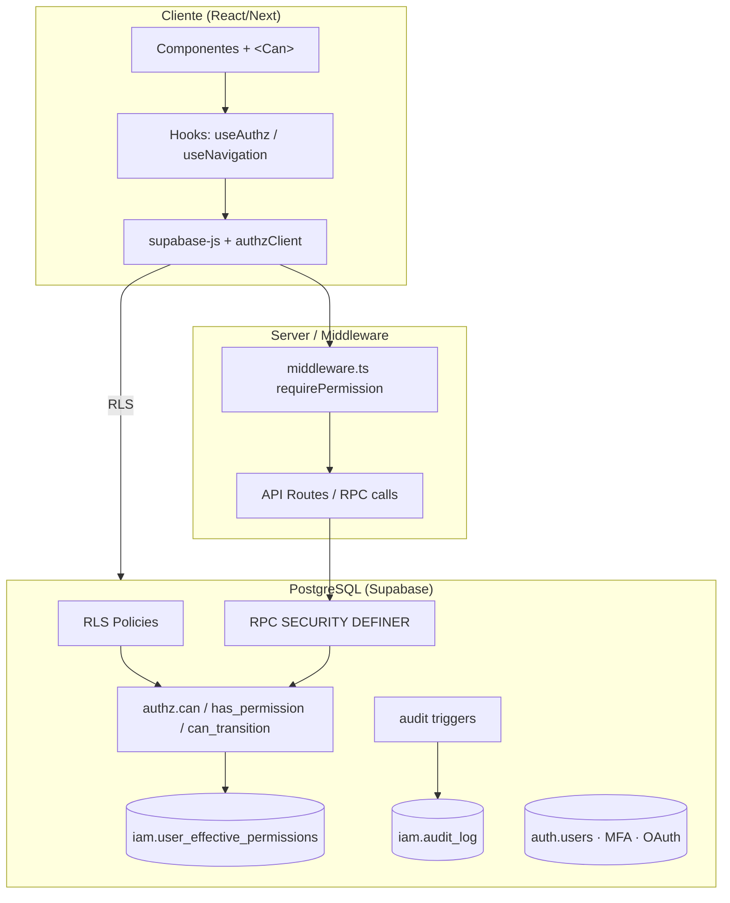
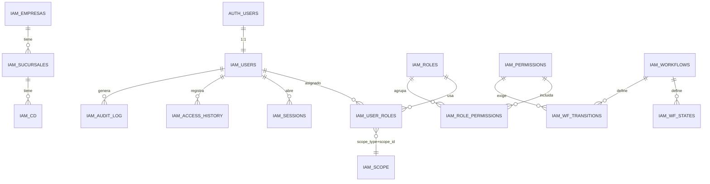
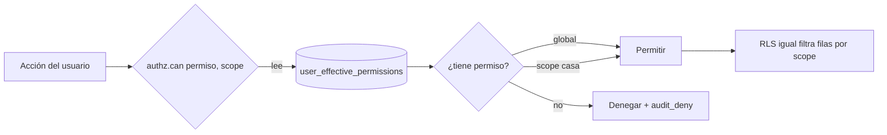
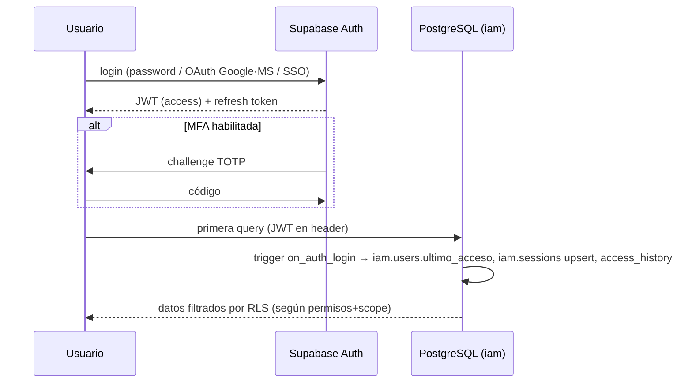

# CCO — Módulo Identity & Security (Enterprise)

> CCO dejó de ser "una app con usuarios": es un **ERP vertical logístico** (15+
> dominios). Por eso el módulo no se llama *Usuarios* sino **Identity & Security**,
> con el nivel de SAP EWM / Manhattan WMS / Oracle WMS. Tres capas de control:
> **RBAC** (qué puede hacer) + **ABAC** (sobre qué datos, con *condiciones* de
> atributo, no solo scope) + **Workflow Engine** (si puede mover un proceso de un
> estado a otro). Sobre Supabase/PostgreSQL + RLS; MFA/OAuth/SSO. Escala años
> (500+ usuarios, 100+ roles, 1000+ permisos, multi-empresa/sucursal/bodega/cliente)
> **sin rediseñar**.
>
> **Componentes del módulo:** Usuarios · Roles · Permisos · Equipos · Departamentos ·
> Empresas · Sucursales · Centros de Distribución · Bodegas · Scopes · **Políticas
> ABAC condicionales** · Workflow Permissions · Grupos dinámicos · Delegación
> temporal · Sustituciones (vacaciones) · Sesiones · MFA · API Keys · OAuth/SSO ·
> Historial de accesos · Auditoría/Bitácora · Menú dinámico.
>
> Estructura: la **Parte I** (§0–§17) define el núcleo RBAC + scopes + workflow +
> auditoría. La **Parte II** (§18–§24) lo eleva a Identity & Security enterprise
> (org units, grupos dinámicos, delegación/sustitución y **ABAC condicional**).
>
> **Regla firme (petición del owner):** el rediseño es **ADITIVO, no destructivo**.
> Los usuarios, roles y permisos actuales **se conservan y se migran** (§17); lo
> nuevo se agrega encima. Nadie pierde acceso.
>
> **Nota de stack.** El diseño de BD (Supabase/Postgres/RLS) es idéntico para
> cualquier front. La capa de aplicación se especifica en TypeScript (Next 16 /
> React 19 objetivo); el repo actual (Vite + React 18 + JS) la adopta con la
> misma forma. §16 incluye la migración desde el esquema vigente (`tms_*`).

Convención de esquemas: todo el IAM vive en el esquema **`iam`** (datos) + **`authz`**
(funciones de autorización, sin datos) — aislado del dominio de negocio (`public`).

---

## 0. Principios de diseño

1. **Todo se consulta desde la BD.** Cero `if (role === 'admin')`. La autoridad
   es un conjunto de filas + funciones SQL; el front solo **refleja**.
2. **Permisos por acción, no por módulo.** `recurso.accion` (`inventory.adjust`).
3. **RBAC + ABAC.** El *qué* lo da el permiso (RBAC); el *dónde* lo da el **scope**
   (empresa/sucursal/CD/cliente/transportista) — ABAC ligero.
4. **Autorización centralizada.** Un único `authz.can()` / `authz.can_transition()`
   usado por: RLS (BD), RPCs (BD), middleware (server), hooks (cliente). La misma
   verdad en las 4 capas.
5. **Deny by default.** Sin permiso explícito → denegado. RLS activa en todo.
6. **Auditoría automática** por trigger, no logs manuales.
7. **Desacople por capas:** Repositorios → Servicios → Authz/Workflow/Audit →
   API/RPC → Hooks → Componentes. Cada capa reemplazable.
8. **Supabase Auth como IdP.** `auth.users` es la identidad; `iam.users` el perfil.
   MFA/OAuth/SSO se delegan a Supabase; el IAM solo autoriza.

---

## 1. Arquitectura (capas)



- **auth.users** (Supabase): credenciales, MFA (TOTP), OAuth (Google/Microsoft), SSO.
- **iam.\***: perfil, roles, permisos, scopes, workflow, sesiones, auditoría.
- **authz.\***: funciones puras de decisión (usadas por RLS, RPC, middleware).
- **Cliente**: nunca decide autoridad; consulta `authz` (vía RPC/`can()`), y la BD
  **igual** filtra por RLS aunque el front falle.

---

## 2. Modelo de datos (DDL)

### 2.1 Organización (entidades de scope)
```sql
create table iam.empresas (
  id uuid primary key default gen_random_uuid(),
  codigo text unique not null, nombre text not null,
  activo boolean not null default true, created_at timestamptz default now()
);
create table iam.sucursales (
  id uuid primary key default gen_random_uuid(),
  empresa_id uuid not null references iam.empresas(id) on delete restrict,
  codigo text not null, nombre text not null, activo boolean default true,
  unique (empresa_id, codigo)
);
create table iam.centros_distribucion (
  id uuid primary key default gen_random_uuid(),
  sucursal_id uuid not null references iam.sucursales(id) on delete restrict,
  codigo text not null, nombre text not null, activo boolean default true,
  unique (sucursal_id, codigo)
);
-- clientes / transportistas ya existen en dominio; se referencian por id como scope.
```

### 2.2 Usuarios (perfil, 1:1 con auth.users)
```sql
create table iam.users (
  id           uuid primary key references auth.users(id) on delete cascade,
  nombre       text not null,
  apellido     text,
  correo       text not null,                     -- espejo de auth (búsqueda)
  avatar_url   text,
  telefono     text,
  cargo        text,
  empresa_id   uuid references iam.empresas(id),
  sucursal_id  uuid references iam.sucursales(id),
  cd_id        uuid references iam.centros_distribucion(id),
  activo       boolean not null default true,
  mfa_enabled  boolean not null default false,     -- espejo de auth.mfa
  idioma       text not null default 'es',
  zona_horaria text not null default 'America/Santiago',
  preferencias jsonb not null default '{}'::jsonb,  -- tema, densidad, atajos…
  ultimo_acceso timestamptz,
  created_at   timestamptz not null default now(),
  updated_at   timestamptz not null default now()
);
create index on iam.users (empresa_id, sucursal_id, cd_id);
create index on iam.users (lower(correo));
create index on iam.users (activo) where activo;
```

### 2.3 RBAC: roles, permisos, matriz
```sql
create table iam.roles (
  id uuid primary key default gen_random_uuid(),
  codigo text unique not null,          -- 'supervisor', 'chofer', 'analista_inv'
  nombre text not null,
  descripcion text,
  es_sistema boolean not null default false,  -- protegido (no borrable)
  activo boolean not null default true,
  created_at timestamptz default now(), updated_at timestamptz default now(),
  updated_by uuid
);

create table iam.permissions (
  id uuid primary key default gen_random_uuid(),
  codigo text unique not null,          -- 'inventory.adjust' (recurso.accion)
  recurso text not null,                -- 'inventory'
  accion  text not null,                -- 'adjust'
  descripcion text,
  grupo text,                           -- para agrupar en la UI (Inventario…)
  es_sistema boolean not null default false,
  created_at timestamptz default now(),
  unique (recurso, accion)
);

create table iam.role_permissions (
  role_id uuid not null references iam.roles(id) on delete cascade,
  permission_id uuid not null references iam.permissions(id) on delete cascade,
  primary key (role_id, permission_id)
);
create index on iam.role_permissions (permission_id);
```

### 2.4 Scopes: asignación de rol con alcance (ABAC)
Un usuario tiene **rol X con alcance Y**. `scope_type='global'` = todo.
```sql
create type iam.scope_type as enum ('global','empresa','sucursal','cd','cliente','transportista');

create table iam.user_roles (
  id uuid primary key default gen_random_uuid(),
  user_id    uuid not null references iam.users(id) on delete cascade,
  role_id    uuid not null references iam.roles(id) on delete cascade,
  scope_type iam.scope_type not null default 'global',
  scope_id   uuid,                              -- null si global
  granted_by uuid references iam.users(id),
  granted_at timestamptz not null default now(),
  expires_at timestamptz,                       -- accesos temporales
  -- un mismo (usuario, rol, scope) no se duplica
  unique (user_id, role_id, scope_type, scope_id),
  check (scope_type = 'global' or scope_id is not null)
);
create index on iam.user_roles (user_id);
create index on iam.user_roles (role_id);
create index on iam.user_roles (scope_type, scope_id);
```

### 2.5 Vista de permisos efectivos (el corazón de la decisión)
```sql
create or replace view iam.user_effective_permissions as
select ur.user_id, p.codigo as permission, ur.scope_type, ur.scope_id
from iam.user_roles ur
join iam.role_permissions rp on rp.role_id = ur.role_id
join iam.permissions p       on p.id = rp.permission_id
join iam.roles r             on r.id = ur.role_id and r.activo
where (ur.expires_at is null or ur.expires_at > now());
```
> A gran escala se materializa (`iam.mv_user_permissions`) con refresh incremental
> por trigger sobre `user_roles`/`role_permissions` — ver §15.

### 2.6 Workflow permissions (estados con permiso por transición)
```sql
create table iam.workflows (
  codigo text primary key, nombre text not null, descripcion text,
  activo boolean default true
);
create table iam.workflow_states (
  workflow text references iam.workflows(codigo) on delete cascade,
  codigo text, etiqueta text, es_inicial boolean default false,
  es_final boolean default false, orden int default 0, color text,
  primary key (workflow, codigo)
);
create table iam.workflow_transitions (
  id uuid primary key default gen_random_uuid(),
  workflow text not null references iam.workflows(codigo) on delete cascade,
  desde text, hasta text not null, accion text not null,
  permission_id uuid references iam.permissions(id),   -- permiso EXIGIDO
  scope_required boolean not null default false,       -- ¿debe casar el scope de la entidad?
  orden int default 0,
  constraint wf_from_fk foreign key (workflow, desde) references iam.workflow_states(workflow, codigo),
  constraint wf_to_fk   foreign key (workflow, hasta) references iam.workflow_states(workflow, codigo)
);
create table iam.workflow_history (
  id bigint generated always as identity primary key,
  workflow text not null, entidad_id text not null,
  desde text, hasta text, accion text,
  user_id uuid, scope_type iam.scope_type, scope_id uuid,
  nota text, creado_en timestamptz default now()
);
create index on iam.workflow_history (workflow, entidad_id, creado_en desc);
```

### 2.7 Sesiones e historial de acceso
```sql
create table iam.sessions (
  id uuid primary key default gen_random_uuid(),
  user_id uuid not null references iam.users(id) on delete cascade,
  auth_session_id uuid,                 -- id de la sesión Supabase (si aplica)
  device text, user_agent text, ip inet,
  created_at timestamptz default now(),
  last_seen timestamptz default now(),
  revoked_at timestamptz,               -- cierre forzado
  revoked_by uuid
);
create index on iam.sessions (user_id) where revoked_at is null;

create table iam.access_history (
  id bigint generated always as identity primary key,
  user_id uuid references iam.users(id) on delete set null,
  correo text, resultado text not null,     -- ok | fail | mfa_required | blocked
  metodo text,                              -- password | google | microsoft | sso
  ip inet, user_agent text, device text,
  creado_en timestamptz default now()
);
create index on iam.access_history (user_id, creado_en desc);
```

### 2.8 Auditoría (automática, before/after)
```sql
create table iam.audit_log (
  id bigint generated always as identity primary key,
  ts timestamptz not null default now(),
  user_id uuid, actor_email text,
  accion text not null,                 -- insert | update | delete | login | authz_deny
  recurso text,                         -- módulo lógico ('inventory')
  tabla text, registro_id text,
  valor_anterior jsonb, valor_nuevo jsonb,
  ip inet, dispositivo text, navegador text,
  resultado text not null default 'ok', -- ok | deny | error
  scope_type iam.scope_type, scope_id uuid
) partition by range (ts);              -- particionada por mes (§15)
create index on iam.audit_log (tabla, registro_id, ts desc);
create index on iam.audit_log (user_id, ts desc);
```

---

## 3. Diagrama ER



---

## 4. Flujo de autorización



Regla de resolución (una sola, en `authz.has_permission`):
1. ¿Existe fila en `user_effective_permissions` con ese `permission` y `scope_type='global'`? → **permite**.
2. Si se pide en un scope concreto (`sucursal`, id X): ¿existe fila con ese permiso y `(scope_type, scope_id)` = (sucursal, X)? → **permite**.
3. Jerarquía: un grant en `empresa` cubre sus `sucursales` y `cd` (se expande por FK). → **permite**.
4. Si no → **deniega** (y se audita `authz_deny`).

---

## 5. Flujo de autenticación


- **JWT** lo emite Supabase; contiene `sub`=user id, `role`, y (opcional) claims IAM
  vía *custom access token hook* (empresa/sucursal/roles para RLS rápida).
- **Refresh** automático (supabase-js). **Force logout** = `iam.sessions.revoked_at` +
  `auth.admin.signOut(session)`.

---

## 6. Modelo RBAC

- **Roles** = colecciones de permisos, **creables desde el panel** (`iam.roles`,
  `es_sistema` protege los base). Un usuario tiene **N roles** (`iam.user_roles`).
- **Permisos** = catálogo `recurso.accion` (`iam.permissions`). Ejemplos por dominio:

| Recurso | Acciones |
|---|---|
| `inventory` | view, create, update, delete, adjust, count, transfer |
| `reception` | view, create, confirm |
| `quality` | view, dictaminate, issue_certificate, reject, quarantine |
| `nv` | view, create, update, change_state, delete |
| `shipping` | view, dispatch, approve |
| `transport` | view, create, assign_vehicle, assign_driver, dispatch, reprogram, cancel |
| `courier` | view, create, track |
| `postventa` | ticket.view, ticket.create, ticket.assign, ticket.close, ticket.reopen |
| `service` | view, report, close |
| `dashboard` | view, tv.view |
| `catalog` | product.view, product.manage, client.view, client.manage, address.view, address.manage |
| `settings` | users, roles, permissions, workflows, audit, sessions, iam.manage |

> Naming: `recurso.accion` en minúscula/`snake`. Sub-recurso con punto
> (`postventa.ticket.close`) permitido. El catálogo es **dato**, se amplía sin deploy.

---

## 7. Workflow Permissions

Cada **transición** exige un permiso (y opcionalmente que el *scope* del usuario
cubra la entidad). Reemplaza los `if` por filas en `iam.workflow_transitions`.

Ejemplo (NV → despacho → entrega):
```
Registro NV → En Proceso   acción 'procesar'      requiere nv.change_state
En Proceso  → Shipping      acción 'a_shipping'    requiere shipping.dispatch      (Supervisor)
Shipping    → Transporte    acción 'despachar'     requiere shipping.approve       (Supervisor)
Transporte  → En Ruta       acción 'salir_ruta'    requiere transport.dispatch     (Chofer/TMS)
En Ruta     → Entregado     acción 'entregar'      requiere transport.pod          (Chofer)
Entregado   → Cerrado       acción 'cerrar'        requiere nv.close
(Calidad)   emitir_cert.    acción 'certificar'    requiere quality.issue_certificate (Calidad)
```
Decisión única: `authz.can_transition(workflow, desde, hasta, scope)` → busca la
transición, resuelve su `permission_id` vía `authz.has_permission`, exige scope si
`scope_required`. La RPC de dominio (`nv_change_state`, `transport_dispatch`…) llama
a esta función; **nadie transiciona sin pasar por aquí**.

---

## 8. Scope Permissions (ABAC)

- El scope viaja en `iam.user_roles(scope_type, scope_id)`. Un usuario puede tener
  el rol *Analista Inventario* **solo en Sucursal Norte** y otro *Supervisor*
  **global**.
- **Jerarquía**: `empresa` ⊇ `sucursales` ⊇ `cd`. `authz.has_permission` expande el
  scope hacia abajo (una función `authz.scope_matches(grant_type, grant_id, target_type, target_id)`).
- **Filtrado real por RLS**: cada tabla de dominio con dueño de scope (ej.
  `inventario.sucursal_id`) lleva una policy que además de permiso valida scope:
  ```sql
  create policy inv_select on public.tms_inventario_general for select to authenticated
  using ( authz.has_permission('inventory.view')
          and authz.scope_ok('sucursal', sucursal_id) );
  ```
- Tipos de scope soportados: `empresa, sucursal, cd, cliente, transportista, global`.
  Añadir uno nuevo = valor en el enum + rama en `scope_matches` (sin rediseño).

---

## 9. Authorization Service (BD + cliente)

### 9.1 Funciones SQL (esquema `authz`) — fuente única de verdad
```sql
create or replace function authz.uid() returns uuid
  language sql stable as $$ select auth.uid() $$;

-- ¿el usuario actual tiene el permiso? (opcionalmente dentro de un scope)
create or replace function authz.has_permission(
  p_code text, p_scope_type iam.scope_type default null, p_scope_id uuid default null
) returns boolean language sql stable security definer set search_path = iam, authz, public as $$
  select exists (
    select 1 from iam.user_effective_permissions e
    where e.user_id = auth.uid() and e.permission = p_code
      and ( e.scope_type = 'global'
         or p_scope_type is null
         or authz.scope_matches(e.scope_type, e.scope_id, p_scope_type, p_scope_id) )
  );
$$;

-- atajo booleano usado en RLS por dueño de scope
create or replace function authz.scope_ok(p_type iam.scope_type, p_id uuid)
returns boolean language sql stable as $$
  select authz.has_permission_any_for_scope(p_type, p_id) $$;  -- ver impl. completa

-- ¿puede ejecutar la transición del workflow?
create or replace function authz.can_transition(
  p_workflow text, p_desde text, p_hasta text,
  p_scope_type iam.scope_type default null, p_scope_id uuid default null
) returns boolean language plpgsql stable security definer as $$
declare t iam.workflow_transitions;
begin
  select * into t from iam.workflow_transitions
   where workflow=p_workflow and hasta=p_hasta and (desde is not distinct from nullif(p_desde,''));
  if t.id is null then return false; end if;                     -- transición inexistente
  if t.permission_id is null then return true; end if;
  return authz.has_permission(
    (select codigo from iam.permissions where id=t.permission_id),
    case when t.scope_required then p_scope_type end,
    case when t.scope_required then p_scope_id end);
end $$;
```

### 9.2 RLS (patrón)
Toda tabla de dominio: `enable row level security`; `select` gateado por
`authz.has_permission('<recurso>.view')` (+ `scope_ok` si tiene dueño de scope);
`insert/update/delete` por la acción específica. **Cero** `USING (true)`.

### 9.3 Cliente (TS) — refleja, no decide
```ts
// authzClient.ts — cachea los permisos efectivos del usuario (RPC iam_me)
export interface Authz {
  can(permission: string, scope?: Scope): boolean;
  canAny(perms: string[], scope?: Scope): boolean;
  canAll(perms: string[], scope?: Scope): boolean;
  canTransition(wf: string, from: string, to: string, scope?: Scope): Promise<boolean>;
}
```
`iam_me()` (RPC) devuelve `{ user, roles, permissions: EffectivePermission[] }`; el
cliente resuelve `can()` en memoria (rápido) y la BD **igual** re-valida por RLS.

---

## 10. API (desacoplada por capas)

```
authz/         (decisión)      → SQL authz.* + authzClient.ts
audit/         (trazabilidad)  → triggers + auditService (lectura)
workflow/      (transiciones)  → authz.can_transition + workflowService
iam services   (negocio)       → iamService (usuarios/roles/permisos/scopes)
repositories   (datos)         → *Repo.ts (supabase-js, solo queries)
rpc            (mutaciones)    → funciones SECURITY DEFINER gateadas por authz.*
middleware     (server)        → requirePermission(perm) en API routes / server actions
```

**Repositorios** (solo I/O, sin reglas): `usersRepo`, `rolesRepo`, `permissionsRepo`,
`userRolesRepo`, `sessionsRepo`, `auditRepo`, `workflowRepo`.

**RPCs (mutaciones gateadas)** — nunca escritura directa del cliente:
`iam_user_upsert`, `iam_user_set_active`, `iam_role_upsert`, `iam_role_set_permissions(role, perm[])`,
`iam_user_assign_role(user, role, scope_type, scope_id)`, `iam_user_revoke_role(id)`,
`iam_permission_upsert`, `iam_session_revoke(id)`, `iam_sessions_revoke_all(user)`,
`iam_workflow_transition_upsert`. Cada una: `if not authz.has_permission('settings.roles') then raise 'No autorizado'`.

**Middleware server** (Next):
```ts
export const requirePermission = (perm: string) => async (req) => {
  const { data } = await supabase.rpc('authz_has_permission', { p_code: perm });
  if (!data) return new Response('Forbidden', { status: 403 });
};
```

---

## 11. Hooks React

```ts
useAuth()            // sesión + perfil (iam_me)
useAuthz()           // { can, canAny, canAll, canTransition } — memoizado
usePermissions()     // catálogo (para editores)
useRoles()           // CRUD roles + matriz
useUserRoles(userId) // asignaciones con scope
useNavigation()      // menú dinámico derivado de permisos (§ Sidebar)
useSessions(userId)  // sesiones activas + revocar
useAuditLog(filtros) // auditoría paginada
useWorkflowPerms(wf) // transiciones × permiso
```
Componentes de guarda:
```tsx
<Can permission="inventory.adjust" scope={{type:'sucursal',id}}> … </Can>
<RequirePermission permission="settings.roles" redirect="/403"> <RolesPage/> </RequirePermission>
```
`<Can>` no renderiza el hijo si `!can()`. La **ruta** también se protege server-side
(middleware) y la **BD** por RLS → defensa en profundidad (el botón, la ruta y el dato).

---

## 12. Componentes / Pantallas

| Pantalla | Contenido |
|---|---|
| **Usuarios** | Lista + filtros (empresa/sucursal/rol/activo), alta/edición, avatar, MFA, activar/desactivar, asignar roles con scope. |
| **Roles** | Lista + editor; matriz de permisos del rol (checkboxes por grupo). Clonar rol. |
| **Permisos** | Catálogo `recurso.accion`, agrupado; alta (para módulos nuevos). |
| **Matriz (Excel)** | Grid **roles × permisos** con celdas toggle, filtros, sticky headers, export. |
| **Workflow Permissions** | Por proceso: transiciones × permiso exigido + scope; editor visual. |
| **Asignación de usuarios** | Panel bulk: asignar rol+scope a varios usuarios. |
| **Sesiones activas** | Dispositivos, IP, último visto; cerrar una o todas. |
| **Historial de acceso** | Logins (ok/fallo/MFA), método, IP. |
| **Auditoría** | Log before/after filtrable (usuario, tabla, fecha, resultado), detalle diff. |

---

## 13. Estructura de carpetas

```
src/
  modules/iam/
    domain/            # types.ts, enums.ts, permissions.catalog.ts
    data/              # *Repo.ts (supabase-js)
    services/          # iamService, authzService, auditService, workflowService
    hooks/             # useAuthz, useRoles, useNavigation, ...
    components/        # <Can>, <RequirePermission>, PermissionMatrix, RoleEditor, ...
    app/(settings)/    # /settings/users, /roles, /permissions, /workflows, /sessions, /audit
  lib/authz/           # authzClient.ts, guards (server), middleware
  lib/supabase/        # client, server, admin
supabase/
  migrations/          # iam schema, authz functions, RLS, seeds
  functions/           # (edge) custom-access-token-hook, sso-callback
```
Convención: el **dominio IAM es un módulo autocontenido**; el resto de la app solo
importa `useAuthz`, `<Can>` y las rutas. Nada de lógica de permisos fuera de `modules/iam`.

---

## 14. Convenciones

- **Tablas** `iam.*` (snake_case). **Funciones de decisión** `authz.*` (sin datos).
- **Permisos** `recurso.accion`; **roles** por `codigo` slug; nunca comparar por nombre.
- **RLS obligatoria** en toda tabla; escritura solo por RPC `SECURITY DEFINER` gateada.
- **Auditoría por trigger**; el app pasa IP/UA vía `set_config('request.*', …)` o RPC.
- **Deny by default**; permisos/roles de sistema con `es_sistema=true` (no borrables).
- **Nada de `if(role==='admin')`** en TS ni SQL. Todo `authz.can()`.
- **Migraciones** versionadas; el catálogo de permisos se **siembra** por migración
  y se amplía por el panel.

---

## 15. Escalabilidad

- **Materialized view** `iam.mv_user_permissions` (user_id, permission, scope_type,
  scope_id) con índice `(user_id, permission)`; refresh incremental por trigger en
  `user_roles`/`role_permissions`. `has_permission` lee la MV → O(1) por check.
- **Índices** ya definidos en las FK y en `user_effective_permissions`.
- **Auditoría particionada por mes** (`audit_log` RANGE) + retención (drop de
  particiones viejas) → escribe barato, consulta rápida, no crece sin control.
- **Custom access token hook**: inyecta `empresa_id`, `roles`, `perm_hash` en el JWT
  para RLS sin joins en cada query (revalida contra la MV en cambios).
- Soporta **multi-empresa/sucursal/cd/cliente** por diseño (scope), sin tocar el modelo.
- 500+ usuarios · 100+ roles · 1000+ permisos: la MV + índices lo resuelven; el
  costo dominante es el refresh en cambios de rol (raros), no las lecturas.

---

## 16. Roadmap — orden EXACTO de implementación

> Cada fase es desplegable y no rompe la anterior. Migración desde `tms_*` incluida.

**Fase 0 — Fundaciones (BD).** ✅ HECHA — migración `121`.
1. Esquemas `iam`, `authz`. 2. Tablas org (`empresas/sucursales/cd`). 3. `iam.users`
(migrar desde `tms_usuarios`, FK a `auth.users`). 4. `roles`, `permissions`,
`role_permissions`, `user_roles` (+ enum scope). 5. Seed del **catálogo de permisos**
(`recurso.accion`) desde los `tms_permisos` actuales, mapeados. 6. Vista
`user_effective_permissions`.

**Fase 1 — Authorization Service.** ✅ HECHA — migración `122`.
7. `authz.has_permission` (Fase 0) + reconciliación crítica: la fuente canónica del
runtime es `tms_roles.permisos_json` (no la puente `tms_roles_permisos`, que estaba
desactualizada); `iam.role_permissions` se **reconstruye desde `permisos_json`** →
paridad exacta en los 8 roles. 8. **Espejo vivo** con triggers `tms_* → iam.*`
(`authz.rebuild_role`/`sync_permiso`/`sync_user_profile`); el gate central
`usuario_tiene_algun_permiso` se reescribe para leer del IAM **conservando la rama
legada** `permisos_json` (superconjunto → cero bloqueos). Los asserts de dominio
(`_pv_assert`, `can_manage_*`, `_conteo_es_super`, `puede_desplegar_ota`, …) siguen
sobre `permisos_json` (canónico y espejado); se encaminan por `authz.has_permission`
en una fase posterior. 9. `iam_me()` RPC ✅. 10. **RLS por permiso** en tablas de
dominio (empezando por las críticas), retirando `USING(true)` — pendiente (fase futura).

**Fase 2 — Cliente / menú dinámico.** ✅ HECHA (v1.55.60).
11. `useAuthz` + `<Can>` + `<RequirePermission>` (`src/components/authz/index.jsx`),
capa sobre `AuthContext` ✅. El cliente consume el IAM: `AuthContext.loadRoleConfig`
llama `iam_me()` y usa sus permisos en **unión con `permisos_json` legado** (red de
seguridad, igual que el gate del servidor) ✅. 12. El menú y el guard de rutas ya
derivan de `hasPermission` (un solo origen) — el `menuCategories` de `Navbar.jsx` es
estructura estática pero su **visibilidad es 100% permission-derived**; NO se hace un
rewrite riesgoso a `useNavigation`, se conserva el patrón vigente. 13. Middleware
server — N/A (SPA + RLS; la autorización real vive en el servidor vía RPCs/gates).

**Fase 3 — Workflow Permissions.** ✅ HECHA (v1.55.61, migración `123`).
14. Las tablas `workflow_*` (mig 108) siguen siendo la fuente canónica — NO se crea
copia `iam.*` redundante (misma decisión que en Fase 1). 15. **`authz.can_transition`**
(workflow, desde, accion) ✅ — decisión sin efectos que reusa el gate IAM
(`usuario_tiene_algun_permiso`). 16. **`wf_transicionar` re-centrado** sobre
`authz.can_transition` ✅ (regla única). Los procesos de dominio (OT/NV/CALIDAD/CONTEO/
TICKET_PV) emiten a `workflow_history`; encaminar TODAS sus RPC por `can_transition`
queda para una fase de consolidación (hoy conservan sus asserts de dominio, que ya
leen el IAM vía `permisos_json` espejado). 17. **Editor visual de transiciones × permiso**
ya existía (`Admin → Workflows`, `TransModal` con selector de permiso); Fase 3 le suma
un **Simulador de permisos** (`wf_acciones_disponibles`) que evalúa en vivo qué acciones
puede ejecutar el usuario en sesión desde cada estado.

**Fase 4 — Scopes (ABAC).**
18. Poblar `scope_id` en asignaciones. 19. Añadir `sucursal_id/cd_id` (dueño de scope)
a tablas de dominio + policies con `scope_ok`. 20. UI de asignación con scope.

**Fase 5 — Sesiones + Auditoría.**
21. `iam.sessions`, `access_history`; hooks de login (trigger + app). 22. Pantalla de
sesiones (cerrar/forzar). 23. `audit_log` particionada + trigger genérico
`authz.audit()` en tablas sensibles. 24. Visor de auditoría con diff.

**Fase 6 — Seguridad avanzada.**
25. MFA (TOTP) vía Supabase + espejo `mfa_enabled`. 26. OAuth Google/Microsoft.
27. SSO/SAML (Supabase). 28. Custom access token hook (claims IAM en JWT).

**Fase 7 — Escala.**
29. `mv_user_permissions` + refresh incremental. 30. Retención/particiones de auditoría.
31. Carga masiva de usuarios/roles.

**Orden de construcción de componentes (front):**
`useAuthz` → `<Can>` → `useNavigation`/Sidebar → Pantalla Roles (matriz) → Pantalla
Permisos → Pantalla Usuarios (+asignación scope) → Workflow editor → Sesiones →
Auditoría. (Primero la **decisión** y la **guarda**; las pantallas de gestión después.)

---

## 17. Migración desde el CCO actual (`tms_*`)

| Actual | Objetivo | Nota |
|---|---|---|
| `tms_usuarios` | `iam.users` | FK a `auth.users`; +empresa/sucursal/cd, idioma, tz, prefs, MFA |
| `tms_roles` | `iam.roles` | +`codigo`, `es_sistema` |
| `tms_permisos` (por módulo) | `iam.permissions` (`recurso.accion`) | mapear `manage_tms`→`transport.manage`, `view_stock`→`inventory.view`, … |
| `tms_roles_permisos` | `iam.role_permissions` | directo |
| (rol en `tms_usuarios`) | `iam.user_roles` | pasar a N:N con scope `global` |
| `workflow_*` (mig 108–112) | `iam.workflow_*` | ya existe `permiso_id` por transición → renombrar a `permission_id` |
| gates `_*_puede_*` | `authz.has_permission` | una sola función |
| `tms_auditoria`/`workflow_history` | `iam.audit_log` + `iam.workflow_history` | unificar |

> El actual ya implementa **~80%** de las ideas (permisos por acción parcial, roles en
> BD, workflow con permiso por transición, auditoría, gates). Este rediseño lo
> **formaliza, generaliza (scopes) y desacopla** para escala enterprise — no parte de cero.

---

# Parte II — Identity & Security enterprise

## 18. Unidades organizacionales (org units)

Jerarquía de scope + estructura de personas. El scope de un acceso puede apuntar a
cualquiera de estos niveles.

```
Empresa
 └─ Departamento           (Operaciones, Calidad, TMS, Post-Venta, TI…)
 └─ Sucursal
     └─ Centro de Distribución (CD)
         └─ Bodega
Equipo (Team)               (transversal: p.ej. "Choferes Zona Norte")
```

```sql
create table iam.departamentos (
  id uuid primary key default gen_random_uuid(),
  empresa_id uuid not null references iam.empresas(id) on delete restrict,
  codigo text not null, nombre text not null, activo boolean default true,
  unique (empresa_id, codigo)
);
create table iam.bodegas (
  id uuid primary key default gen_random_uuid(),
  cd_id uuid not null references iam.centros_distribucion(id) on delete restrict,
  codigo text not null, nombre text not null, activo boolean default true,
  unique (cd_id, codigo)
);
-- Equipos (agrupación de personas, transversal a la jerarquía)
create table iam.teams (
  id uuid primary key default gen_random_uuid(),
  codigo text unique not null, nombre text not null,
  departamento_id uuid references iam.departamentos(id),
  lider_id uuid references iam.users(id), activo boolean default true
);
create table iam.team_members (
  team_id uuid references iam.teams(id) on delete cascade,
  user_id uuid references iam.users(id) on delete cascade,
  primary key (team_id, user_id)
);
```
Se extiende el enum de scope: `iam.scope_type = (global, empresa, departamento,
sucursal, cd, bodega, cliente, transportista)`. `authz.scope_matches` expande la
jerarquía (empresa ⊇ depto/sucursal ⊇ cd ⊇ bodega).

## 19. Principals: asignar roles a usuario, equipo, departamento o grupo

El acceso no se asigna solo a usuarios: también a **equipos/departamentos/grupos**
(un rol al equipo "Choferes" y todos sus miembros lo heredan). Se generaliza
`user_roles` → **`assignments`**:

```sql
create type iam.principal_type as enum ('user','team','department','group');
create table iam.assignments (
  id uuid primary key default gen_random_uuid(),
  principal_type iam.principal_type not null,
  principal_id uuid not null,                 -- user/team/department/group
  role_id uuid not null references iam.roles(id) on delete cascade,
  scope_type iam.scope_type not null default 'global',
  scope_id uuid,
  granted_by uuid, granted_at timestamptz default now(), expires_at timestamptz,
  unique (principal_type, principal_id, role_id, scope_type, scope_id),
  check (scope_type='global' or scope_id is not null)
);
create index on iam.assignments (principal_type, principal_id);
```
La vista de permisos efectivos resuelve **todos los principals del usuario**
(él mismo + sus equipos + su departamento + sus grupos + delegaciones activas):

```sql
create or replace view iam.user_effective_permissions as
with principals as (
  select u.id as user_id, 'user'::iam.principal_type pt, u.id pid from iam.users u
  union all select tm.user_id, 'team', tm.team_id from iam.team_members tm
  union all select u.id, 'department', d.id from iam.users u
    join iam.sucursales s on s.id=u.sucursal_id  -- depto por estructura, o tabla puente
    join iam.departamentos d on d.empresa_id=u.empresa_id
  union all select gm.user_id, 'group', gm.group_id from iam.group_members gm
)
select pr.user_id, p.codigo as permission, a.scope_type, a.scope_id
from principals pr
join iam.assignments a on a.principal_type=pr.pt and a.principal_id=pr.pid
join iam.role_permissions rp on rp.role_id=a.role_id
join iam.permissions p on p.id=rp.permission_id
where a.expires_at is null or a.expires_at>now();
```

## 20. Grupos dinámicos

Grupos cuya membresía se **calcula por reglas de atributo** (no manual). Ej.:
"todos los usuarios con cargo *Chofer* en Sucursal Norte".

```sql
create table iam.groups (
  id uuid primary key default gen_random_uuid(),
  codigo text unique not null, nombre text not null,
  tipo text not null default 'static' check (tipo in ('static','dynamic')),
  regla jsonb,                 -- predicado de atributos (solo dynamic)
  activo boolean default true
);
create table iam.group_members (
  group_id uuid references iam.groups(id) on delete cascade,
  user_id  uuid references iam.users(id) on delete cascade,
  dinamico boolean default false,   -- true = calculado
  primary key (group_id, user_id)
);
```
La membresía dinámica se **materializa** por trigger/cron: `iam.refresh_dynamic_group(g)`
evalúa `regla` contra `iam.users` y sincroniza `group_members(dinamico=true)`. Regla
ejemplo: `{"all":[{"attr":"cargo","op":"eq","value":"Chofer"},{"attr":"sucursal_id","op":"eq","value":"<uuid>"}]}`.

## 21. Delegación temporal y sustituciones (vacaciones)

- **Delegación**: un usuario cede *algunos* roles a otro por una ventana temporal.
- **Sustitución**: cobertura por ausencia (vacaciones) — el sustituto hereda los
  roles del titular durante el rango.

```sql
create table iam.delegations (
  id uuid primary key default gen_random_uuid(),
  tipo text not null check (tipo in ('delegacion','sustitucion')),
  de_user   uuid not null references iam.users(id) on delete cascade,   -- titular
  para_user uuid not null references iam.users(id) on delete cascade,   -- sustituto
  roles uuid[],                       -- null = todos los del titular
  scope_type iam.scope_type, scope_id uuid,  -- opcional: acotar la delegación
  desde timestamptz not null, hasta timestamptz not null,
  motivo text, activo boolean default true, creado_por uuid,
  check (hasta > desde)
);
create index on iam.delegations (para_user) where activo;
```
La vista efectiva añade una rama: si existe delegación **activa y vigente** con
`para_user = auth.uid()`, el sustituto obtiene los roles del titular (los indicados o
todos) durante `[desde, hasta]`. Todo lo actuado bajo delegación se **audita como
"por delegación de <titular>"** (campo en `audit_log`).

## 22. ABAC condicional — el corazón enterprise (estilo SAP EWM)

RBAC dice *qué acción*; el **scope** dice *en qué unidad*; las **políticas** dicen
*bajo qué condiciones del propio dato*. Aquí vive tu ejemplo:

> Editar una NV **solo si**: misma sucursal **y** aún no despachada **y** el cliente
> pertenece a la cartera del usuario.

```sql
create table iam.policies (
  id uuid primary key default gen_random_uuid(),
  permission_id uuid not null references iam.permissions(id) on delete cascade,
  efecto text not null default 'allow' check (efecto in ('allow','deny')),
  prioridad int not null default 100,        -- deny gana; menor prioridad primero
  condicion jsonb not null,                  -- DSL de predicados
  descripcion text, activo boolean default true
);
create index on iam.policies (permission_id) where activo;
```

**DSL de condición** (JSON, evaluable en SQL y en TS):
```json
{ "all": [
  { "attr": "sucursal_id", "op": "eq",     "from": "user.sucursal_id" },
  { "attr": "estado",      "op": "not_in", "value": ["despachado","en_ruta","entregado","cerrado"] },
  { "attr": "cliente_id",  "op": "in",     "from": "user.cartera_clientes" }
]}
```
- `attr` = atributo del **recurso** (la fila). `from` = atributo del **contexto del
  usuario** (sucursal, cartera…). `op` ∈ {eq, ne, in, not_in, gt, lt, contains, is_owner}.
- Combinadores `all` (AND) / `any` (OR) / `not`, anidables.

**Motor de evaluación** (una función, usada por RLS y RPC):
```sql
create or replace function authz.policy_check(
  p_permission text, p_resource jsonb, p_user_ctx jsonb default null
) returns boolean language plpgsql stable security definer as $$
declare pol iam.policies; ctx jsonb := coalesce(p_user_ctx, authz.user_context());
  hay_allow boolean := false;
begin
  for pol in
    select * from iam.policies pl join iam.permissions p on p.id=pl.permission_id
    where p.codigo=p_permission and pl.activo order by pl.prioridad
  loop
    if authz.eval_condition(pol.condicion, p_resource, ctx) then
      if pol.efecto='deny' then return false; end if;   -- deny explícito corta
      hay_allow := true;
    end if;
  end loop;
  -- sin políticas para el permiso ⇒ solo RBAC+scope deciden (true).
  return (not exists (select 1 from iam.policies pl join iam.permissions p on p.id=pl.permission_id
                      where p.codigo=p_permission and pl.activo)) or hay_allow;
end $$;
```
`authz.user_context()` arma `{ user_id, sucursal_id, cd_id, empresa_id,
cartera_clientes: [...], ... }`. `authz.eval_condition` interpreta el DSL.

**RLS combinada (RBAC + scope + ABAC)** — la policy real de la NV:
```sql
create policy nv_update on public.tms_operaciones for update to authenticated
using ( authz.has_permission('nv.update', 'sucursal', sucursal_id)          -- RBAC + scope
        and authz.policy_check('nv.update', to_jsonb(tms_operaciones.*)) );  -- ABAC condicional
```
La misma condición se refleja en la UI (`useAuthz().canOn('nv.update', nv)`) para
deshabilitar el botón — pero **la BD es la que garantiza**.

## 23. Decisión unificada (las 3 capas en una llamada)

```
authz.authorize(permission, resource?, scope?) =
      has_permission(permission, scope)      -- RBAC + scope (ABAC de unidad)
  AND policy_check(permission, resource)     -- ABAC condicional (atributos del dato)
  AND (si es transición) can_transition(...)  -- Workflow
```
Un único punto (`authz.authorize`) usado por RLS, RPC, middleware y hooks. El front
expone `can()` (permiso), `canOn(perm, recurso)` (permiso+condición) y
`canTransition()`.

## 24. Roadmap ampliado (Identity & Security)

A las fases de la Parte I se suman:
- **Fase 4.5 — Org units & principals.** `departamentos/bodegas/teams`; generalizar
  `user_roles`→`assignments` (principal user/team/dept/group); UI de estructura.
- **Fase 4.6 — Grupos dinámicos.** `groups` + motor de reglas + refresh; UI de reglas.
- **Fase 8 — ABAC condicional.** `policies` + `eval_condition` + `user_context`;
  editor de políticas; encajar en RLS de las tablas críticas (NV primero, con tu
  ejemplo). *Este es el diferenciador enterprise.*
- **Fase 9 — Delegación & sustituciones.** `delegations` + rama en la vista efectiva +
  auditoría "por delegación"; UI de vacaciones/cobertura.

**Prioridad recomendada:** Parte I (Fase 0→3) primero — da la base RBAC + scopes +
workflow que ya casa con el CCO actual. Luego **ABAC condicional (Fase 8)** porque es
lo que te falta para el nivel SAP/Manhattan (el ejemplo NV). Org units, grupos y
delegación se intercalan según necesidad operativa.

---
*Documento de arquitectura (Identity & Security). Fuente de verdad junto a
`ARQUITECTURA_CCO.md` (§4/§7). Aditivo y no destructivo. Actualizar al implementar
cada fase.*
