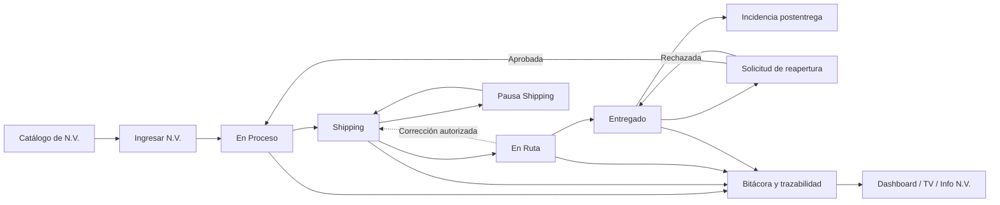

# Panel PTM — Manual funcional, reglas e indicadores

> **Versión auditada:** CCO `1.55.155`
> **Fecha de revisión:** 15-08-2026
> **Alcance:** comportamiento implementado en el frontend y funciones vigentes de Supabase.
> **Propósito:** servir como fuente única para operación, soporte, auditoría, capacitación y futuras mejoras.

---

## 1. Qué es el Panel PTM

El Panel PTM administra el ciclo logístico de una Nota de Venta (N.V.) desde su registro hasta su entrega. Centraliza:

- creación y actualización de N.V.;
- avance controlado de estados;
- pausas justificadas en Shipping;
- incidencias y reaperturas;
- consulta y trazabilidad;
- indicadores operacionales, SLA, Fill Rate y OTIF;
- visualización en Modo TV;
- dashboards configurables;
- catálogos de transportistas y vendedores;
- coordinación privada de rutas.

### 1.1 Flujo general



---

## 2. Pantallas, rutas y permisos

| Pantalla                  | Ruta                   | Permiso normal                             | Función                                        |
| ------------------------- | ---------------------- | ------------------------------------------ | ---------------------------------------------- |
| Dashboard                 | `/panel`               | `view_panel` o `manage_panel`              | Indicadores, gráficos, rankings, alertas y PDF |
| Ingresar N.V.             | `/panel/ingresar`      | `panel_ingresar` o `manage_panel`          | Buscar, crear, editar y avanzar N.V.           |
| Solicitudes de reapertura | `/panel/reaperturas`   | `approve_panel_reopen_nv` o `manage_roles` | Aprobar o rechazar reaperturas                 |
| Info N.V.                 | `/panel/info`          | `panel_info` o `manage_panel`              | Consulta detallada, historial y certificados   |
| Modo TV                   | `/panel/tv`            | `panel_tv` o `manage_panel`                | Monitor operacional en tiempo real             |
| Builder                   | `/panel/builder`       | `panel_builder` o `manage_panel`           | Dashboards personalizados                      |
| Coordinación Rutas        | `/panel/rutas`         | Acceso privado adicional                   | Planificación de rutas y costos                |
| Configuración             | `/panel/configuracion` | `manage_roles`                             | Catálogos y auditoría                          |

### 2.1 Reglas de autorización

1. Las rutas no declaradas se bloquean por defecto.
2. Un administrador o administrador delegado puede superar las validaciones normales de rutas.
3. `manage_panel` entrega administración funcional del Panel, pero **no** permite aprobar reaperturas por sí solo.
4. La aprobación de reaperturas exige `approve_panel_reopen_nv`, `manage_roles`, administrador o `service_role`.
5. La escritura de operaciones exige administrador, `manage_panel` o `service_role`.
6. IAM puede limitar creación, lectura, edición y cambio de estado por centro de costo.
7. La base de datos vuelve a verificar el alcance: ocultar un botón no reemplaza la autorización del servidor.
8. Coordinación Rutas está restringida adicionalmente al propietario configurado por `auth_uid`; no aparece como módulo general de producción.

### 2.2 Permisos de negocio principales

| Permiso                   | Capacidad                                                             |
| ------------------------- | --------------------------------------------------------------------- |
| `view_panel`              | Ver dashboard base                                                    |
| `manage_panel`            | Gestionar operaciones y acceder a pantallas administrativas del Panel |
| `panel_ingresar`          | Acceso específico a Ingresar N.V.                                     |
| `panel_info`              | Consulta de N.V. sin otorgar gestión completa                         |
| `panel_tv`                | Acceso a Modo TV                                                      |
| `panel_builder`           | Acceso al Builder                                                     |
| `approve_panel_reopen_nv` | Resolver solicitudes de reapertura                                    |
| `manage_roles`            | Administración IAM, configuración y aprobación de reaperturas         |

---

## 3. Fuentes de datos y persistencia

### 3.1 Objetos principales

| Objeto                             | Uso                                                                             |
| ---------------------------------- | ------------------------------------------------------------------------------- |
| `tms_operaciones`                  | Registro maestro operativo de cada N.V.                                         |
| `tms_operaciones_vigentes`         | Vista de lectura usada por dashboard y consultas                                |
| `tms_nv_catalogo`                  | Fuente para completar cliente, vendedor, centro de costo, división y aprobación |
| `tms_nv_bitacora`                  | Auditoría automática de creación, estado y campos sensibles                     |
| `tms_nv_reaperturas`               | Solicitudes, aprobación y rechazo de reaperturas                                |
| `tms_panel_transportistas`         | Catálogo de transportistas                                                      |
| `tms_panel_vendedores`             | Catálogo de vendedores, centro de costo y división                              |
| `consolidados` / `consolidado_nvs` | Agrupación de N.V. excluida de determinados indicadores                         |
| `tms_dashboard_layouts`            | Diseños guardados en Builder                                                    |
| `tms_builder_calculated_fields`    | Campos calculados del Builder                                                   |
| `nv_certificados_salida`           | Informes/certificados asociados a la N.V.                                       |
| tablas `tms_rutas_*`               | Planes, paradas, retiros y datos de Coordinación Rutas                          |

### 3.2 Seguridad de lectura y escritura

- `tms_operaciones` tiene RLS y filtra cada fila mediante el alcance IAM del usuario.
- Los catálogos de transportistas y vendedores son legibles por usuarios autenticados.
- Una solicitud de reapertura es visible para un aprobador o para quien la solicitó.
- Los layouts y campos calculados del Builder son legibles por usuarios autenticados; las mutaciones pasan por RPC autorizadas.
- Las funciones de negocio críticas son `SECURITY DEFINER`, pero validan identidad, permisos y alcance antes de modificar datos.

### 3.3 Enriquecimiento automático

Antes de guardar, la base intenta completar campos faltantes desde el catálogo:

1. identifica canal y número de N.V.;
2. busca cliente, vendedor, centro de costo, división y fecha de aprobación;
3. si todavía faltan centro de costo o división, busca esos valores en el catálogo del vendedor;
4. conserva valores válidos ya ingresados; solo completa vacíos.

---

## 4. Canales, tipos y catálogos

### 4.1 Canales de N.V.

- PTM
- Orange
- Farmapack
- Varios

En `Varios` se admiten actualmente:

- N.V. anticipada;
- Demo;
- Regalo;
- Boleta;
- Guía de salida.

### 4.2 Tipos de despacho

- Courier - Inyección
- Directo
- Courier (Retiro / Pick-up)

### 4.3 Datos operacionales disponibles

- número y canal de N.V.;
- cliente;
- vendedor;
- centro de costo;
- división;
- estado y prioridad urgente;
- tipo de despacho y transportista;
- aprobación informada y aprobación real;
- compromiso;
- facturación, despacho y entrega;
- factura, guía, bultos, valor de factura y número de envío;
- incidencia, estado y observación;
- reapertura y pausa de Shipping.

---

## 5. Ingreso y búsqueda de N.V.

### 5.1 Búsqueda

La pantalla busca por el identificador de N.V. y canal. Una coincidencia existente abre el registro para edición; si no existe, prepara una creación.

Reglas:

1. se normalizan espacios y formatos;
2. la comparación de duplicado usa canal + N.V.;
3. la creación usa un bloqueo transaccional por canal + N.V. para evitar duplicados por concurrencia;
4. si dos usuarios intentan crear lo mismo, la segunda operación recibe el registro ya existente;
5. PTM asociado a un cliente Orange requiere validar la N.V. Orange relacionada;
6. `Varios` permite datos manuales porque no siempre existe un catálogo de origen.

### 5.2 Creación

- La N.V. es obligatoria.
- Toda N.V. nueva originada en CCO comienza en **En Proceso**, aunque el cliente envíe otro estado.
- Se verifica el alcance IAM para el centro de costo.
- Se completa la fecha de estado.
- Se registra creación en bitácora y trazabilidad de workflow.

### 5.3 Actualización

- Se recupera primero la fila actual.
- Se diferencia entre edición completa y cambio de estado.
- Un usuario puede tener permiso para cambiar estado sin poder editar el resto de la N.V.
- Una N.V. entregada queda bloqueada para edición normal.
- Los cambios sensibles quedan auditados.

### 5.4 Eliminación

La eliminación está restringida a:

- administrador;
- administrador delegado reconocido por la política vigente;
- usuario autorizado explícitamente (`angelica@ptm.cl` en la función actual);
- `service_role` cuando corresponda al proceso técnico.

No se debe usar la eliminación para corregir estados: existe una corrección auditada específica.

---

## 6. Flujo obligatorio de estados

### 6.1 Estados canónicos

```text
En Proceso → Shipping → En Ruta → Entregado
```

No se permiten saltos, retrocesos libres ni edición directa de una N.V. entregada.

| Estado actual | Siguiente permitido | Significado operacional                              |
| ------------- | ------------------- | ---------------------------------------------------- |
| En Proceso    | Shipping            | N.V. aprobada/registrada, aún en preparación         |
| Shipping      | En Ruta             | Preparación finalizada y salida logística habilitada |
| En Ruta       | Entregado           | Transporte en curso hasta recepción final            |
| Entregado     | Ninguno             | Flujo cerrado; requiere incidencia o reapertura      |

Guardar el mismo estado no se considera un salto.

### 6.2 Normalización de datos históricos

| Estado histórico  | Estado canónico |
| ----------------- | --------------- |
| EN PROCESO        | En Proceso      |
| P / STOCK         | En Proceso      |
| EN SHIPPING       | Shipping        |
| P / VENDEDOR      | Shipping        |
| P / RETIRO        | Shipping        |
| CURRIER / Currier | En Ruta         |
| EN RUTA           | En Ruta         |
| ENTREGADO         | Entregado       |
| RECIBIDO CONFORME | Entregado       |
| RECIBIDO C/OBS    | Entregado       |

### 6.3 Fechas de workflow

Al entrar por primera vez a una etapa se completa, si está vacía:

- `fecha_en_proceso`;
- `fecha_shipping`;
- `fecha_en_ruta`;
- `fecha_entregado`.

Además:

- en Shipping, si falta, se completa la fecha de facturación con hoy;
- al pasar a En Ruta o Entregado, si faltan, se completan despacho y facturación con hoy;
- `fecha_estado` cambia cada vez que cambia el estado;
- las fechas ya existentes no se reemplazan automáticamente.

### 6.4 Corrección excepcional En Ruta → Shipping

Existe una operación auditada para corregir un envío marcado por error:

- solo permite **En Ruta → Shipping**;
- exige motivo entre 10 y 500 caracteres;
- el motivo debe contener letras, por lo que espacios o números solos no sirven;
- limpia `fecha_en_ruta` y `fecha_despacho` para que el avance correcto vuelva a estamparlas;
- conserva en la auditoría las fechas anteriores y el motivo;
- no habilita ningún otro retroceso.

---

## 7. Shipping pausadas

### 7.1 Subestados permitidos

| Código               | Etiqueta           | Uso                                           |
| -------------------- | ------------------ | --------------------------------------------- |
| `REZAGADA_COMERCIAL` | Rezagada comercial | Bloqueo atribuible a gestión comercial        |
| `RETIRO_CLIENTE`     | Retiro de cliente  | Mercadería pendiente de retiro por el cliente |

### 7.2 Reglas

1. Solo una N.V. en Shipping puede pausarse.
2. El subestado y el motivo son obligatorios.
3. Una N.V. pausada no puede pasar a En Ruta.
4. Debe reactivarse antes de continuar el flujo.
5. Al pausar se guarda usuario, fecha, motivo y elegibilidad SLA.
6. Al reactivar se acumula el tiempo pausado en segundos y se limpia la pausa activa.

### 7.3 Elegibilidad para excluir del SLA

La elegibilidad se decide **al iniciar** la pausa:

- si existe fecha compromiso, el límite es compromiso + 1 día;
- si no existe, el límite es aprobación efectiva + 48 horas;
- si la pausa comienza antes de ese límite, queda marcada como elegible;
- una pausa tardía no borra el atraso ya generado.

Mientras una pausa elegible está activa:

- no entra en NVs Activas del KPI principal;
- no entra en Fill Rate, SLA/OTIF contractual ni alertas de estancamiento;
- sí aparece en el KPI y detalle **Shipping pausadas**.

Al reactivar, la promesa efectiva suma días calendario equivalentes a:

```text
días de ajuste = techo(segundos pausados acumulados / 86.400)
```

---

## 8. Fecha compromiso y SLA

### 8.1 Aprobación efectiva

```text
aprobación efectiva = fecha_aprobacion_real, si existe;
                      fecha_aprobacion, en caso contrario
```

Todos los filtros y cálculos que hablan de aprobación deben usar esta prioridad.

### 8.2 Compromiso calculado

Si no hay compromiso explícito:

```text
fecha compromiso = aprobación efectiva + 2 días hábiles
```

- Se cuentan lunes a viernes.
- Si la fecha base cae en fin de semana, se avanza al lunes antes de contar.
- Actualmente no existe un calendario de feriados chilenos en esta fórmula.

### 8.3 Promesa efectiva

Para evitar una promesa anterior a la aprobación real:

```text
promesa base      = compromiso guardado o compromiso calculado
promesa corregida = máximo(promesa base, aprobación efectiva)
promesa efectiva  = promesa corregida + días de pausa acumulados
```

Para Fill Rate, el vencimiento se evalúa al final del día de la promesa (`23:59:59`).

---

## 9. Incidencias y reaperturas

### 9.1 Incidencias durante el flujo

Tipos disponibles:

- problemas de dirección;
- problemas de transporte;
- problema de armado;
- otro.

Estados de incidencia:

- ABIERTA;
- EN GESTIÓN;
- RESUELTA.

Una incidencia cuenta como activa cuando tiene tipo y su estado no es `RESUELTA`.

### 9.2 Incidencia postentrega por armado

Para una N.V. entregada se puede reportar un problema de armado sin reabrirla:

- la observación es obligatoria;
- el estado logístico permanece Entregado;
- incidencia = Problema de armado;
- área = Bodega;
- origen = Postentrega;
- estado de incidencia = Abierta;
- se registran usuario, fecha y auditoría.

### 9.3 Solicitud de reapertura

- Solo se solicita sobre una N.V. Entregada.
- El motivo es obligatorio.
- No puede existir otra solicitud pendiente para la misma N.V.
- La solicitud notifica a administradores/aprobadores.
- Queda visible en la bandeja y para quien la creó.

### 9.4 Resolución

| Decisión | Resultado                                                       |
| -------- | --------------------------------------------------------------- |
| Aprobar  | N.V. pasa de Entregado a En Proceso y se marca `reabierta=true` |
| Rechazar | N.V. permanece Entregado y se registra la decisión              |

Reglas:

- se exige permiso de aprobación;
- un solicitante no administrador no puede aprobar su propia solicitud;
- la interfaz exige observación al rechazar;
- se preservan aprobación, compromiso y primera entrega originales;
- la reapertura no crea una segunda promesa ficticia ni reinicia el SLA histórico;
- todo queda en bitácora y workflow.

> Una reapertura vuelve a activar la operación, pero no debe borrar el incumplimiento que originó el caso. El historial contractual se conserva para auditoría.

---

## 10. Dashboard: alcance temporal

### 10.1 Filtros

- rango manual desde/hasta;
- Última semana: 7 días;
- Último mes: 30 días;
- Últimos 3 meses: 90 días;
- Año completo: 365 días.

El rango se aplica principalmente sobre la **fecha de aprobación efectiva**.

### 10.2 Excepciones deliberadas

- **NVs Activas** es una fotografía en vivo y no depende del rango.
- Las alertas de riesgo y estancamiento usan el backlog actual.
- La tabla de estados combina entregadas del período con activas filtradas del período.
- La tendencia semanal cuenta entradas por aprobación y salidas por entrega real.
- Las N.V. consolidadas se excluyen de métricas de desempeño para no duplicar ni distorsionar el SLA de 48 horas.
- Las pausas SLA activas y elegibles se excluyen de indicadores contractuales.

---

## 11. Indicadores principales

### 11.1 Resumen de Notas de Venta

| Indicador      | Cálculo                                   |
| -------------- | ----------------------------------------- |
| N.º N.V. PTM   | Conteo de filas del canal PTM en el rango |
| N.V. Orange    | Conteo de filas Orange en el rango        |
| N.V. Farmapack | Conteo de filas Farmapack en el rango     |
| Varios         | Conteo de filas Varios en el rango        |

### 11.2 NVs Activas

```text
NVs Activas = N.V. actuales en En Proceso + Shipping + En Ruta
              − pausas Shipping activas elegibles para SLA
```

- Es backlog en vivo.
- No cambia al mover el filtro histórico.
- Las pausadas tienen su propio indicador.

### 11.3 Tardanza Promedio

Universo:

- N.V. entregadas;
- con fecha de despacho y compromiso;
- no consolidadas;
- solo diferencias válidas de hasta 30 días absolutos.

```text
tardanza por N.V. = fecha_despacho − promesa_efectiva
tardanza promedio = suma de tardanzas positivas / cantidad de N.V. tardías
```

Las entregas a tiempo no bajan este promedio: el indicador mide la severidad de las tardías.

### 11.4 A Tiempo

```text
A Tiempo % = entregas con fecha_despacho ≤ promesa_efectiva
             / entregas válidas evaluadas × 100
```

- Usa entregas con fechas necesarias.
- Excluye diferencias anómalas superiores a 30 días absolutos.
- Se muestra redondeado sin decimales.

### 11.5 Fill Rate de Shipping

En este Panel, Fill Rate mide salida oportuna de **En Proceso**, no completitud de líneas/productos.

```text
salida de En Proceso = primera disponible entre:
  fecha_shipping, fecha_en_ruta, fecha_entregado, fecha_despacho

cumple = salida de En Proceso ≤ fin del día de promesa efectiva
Fill Rate = cumple / (cumple + no cumple) × 100
```

Tratamiento de pendientes:

- En Proceso y aún dentro de plazo: todavía no evaluable.
- En Proceso y vencida: no cumple.
- Pausa SLA activa elegible: no evaluable.
- NULA, REFACTURADO o RECHAZADO: no evaluable.

### 11.6 Shipping pausadas

Muestra:

- total de pausadas;
- rezagadas comerciales;
- retiros de cliente;
- cuántas están excluidas temporalmente de SLA.

Al pulsar el indicador se abre el desglose de N.V.

### 11.7 Tasa de entrega

Se calcula internamente aunque no aparece como tarjeta principal actual:

```text
despachos reales = total − NULA − REFACTURADO − RECHAZADO
tasa de entrega = entregadas / despachos reales × 100
```

### 11.8 Cumplimiento semanal de N.V.

Universo: N.V. registradas en la semana calendario actual.

- Excluye descartadas y pausas SLA elegibles.
- Si ya salió de En Proceso, compara esa salida con la promesa.
- Si sigue En Proceso, solo falla después de vencer.

```text
cumplimiento semanal = cumple / evaluables × 100
```

### 11.9 OTIF

Universo actual:

- N.V. Entregadas;
- con despacho y compromiso;
- no consolidadas.

```text
On Time = fecha_despacho ≤ promesa_efectiva
In Full = true (valor fijo en la implementación actual)
OTIF = On Time AND In Full
OTIF % = cumple / total evaluado × 100
```

> **Limitación crítica:** hoy OTIF equivale en la práctica a cumplimiento temporal. No existe validación de cantidad solicitada versus cantidad entregada; por eso no debe presentarse todavía como un OTIF completo de productos.

### 11.10 Incidencias activas

```text
incidencia activa = incidencia informada AND estado_incidencia != RESUELTA
```

Se agrupan además por vendedor, tipo, cliente, transportista y antigüedad.

---

## 12. Tablas, gráficos y análisis

### 12.1 Tabla de estados

Desglosa por:

- En Proceso;
- Shipping;
- En Ruta;
- Entregado;
- canal PTM, Orange, Farmapack y Varios;
- total por estado.

Las filas son interactivas y abren el detalle correspondiente.

### 12.2 Entradas vs. salidas reales por semana

- **Aprobadas:** se agrupan por semana de aprobación efectiva.
- **Entregadas:** se agrupan por semana de `fecha_entregado` real.
- **Promedio diario:** conteo semanal / 5.
- **Balance de cola:** entregadas − aprobadas.

Interpretación:

- balance positivo: se entregó más de lo aprobado esa semana y bajó backlog anterior;
- balance negativo: entró más trabajo del que salió y aumentó la cola;
- aprobadas y entregadas no necesitan corresponder a la misma cohorte.

La trazabilidad nativa comenzó el 17-07-2026; el gráfico usa semanas completas confiables desde el **20-07-2026**. No se deben sacar conclusiones de entregas semanales anteriores a esa fecha.

### 12.3 Tardanza promedio por semana

Agrupa por semana de aprobación efectiva y permite ver:

- días promedio de tardanza positiva;
- porcentaje a tiempo;
- barras o tendencia;
- cantidad de entregas evaluadas.

### 12.4 Tiempos de ciclo

| Etapa                 | Desde               | Hasta                       |
| --------------------- | ------------------- | --------------------------- |
| Lead time total       | Aprobación efectiva | Entrega; si falta, despacho |
| En Proceso → Shipping | Aprobación efectiva | `fecha_shipping`            |
| Shipping → En Ruta    | `fecha_shipping`    | `fecha_en_ruta`             |
| En Ruta → Entregado   | `fecha_en_ruta`     | `fecha_entregado`           |

- Solo usa diferencias entre 0 y 365 días.
- Promedia con un decimal.
- Muestra `n`, cantidad real de casos con ambas fechas.
- El cuello de botella es la etapa con mayor promedio.

### 12.5 Alertas de riesgo de compromiso

Sobre backlog activo actual:

- vencidas;
- vencen hoy;
- vencen mañana.

El detalle muestra N.V., cliente, vendedor, transportista, estado, división, compromiso y días vencidos.

### 12.6 Alertas operacionales por estancamiento

| Estado     | Umbral actual |
| ---------- | ------------: |
| En Proceso | más de 3 días |
| Shipping   | más de 2 días |
| En Ruta    | más de 3 días |

Se usa `fecha_estado`; si falta, `fecha_registro_nv`.

Se excluyen:

- consolidados;
- pausas SLA activas elegibles.

La interfaz permite ajustar el mínimo de N.V. necesario para mostrar una alerta.

### 12.7 Calidad de datos

Detecta:

- estado vacío;
- estado no reconocido;
- cliente faltante;
- vendedor faltante;
- división faltante;
- transportista faltante para En Ruta/Entregado;
- compromiso faltante para una N.V. activa;
- despacho anterior a aprobación;
- entrega anterior a despacho.

Los controles de completitud se concentran en N.V. no descartadas y no terminadas para reducir falsos positivos.

### 12.8 Ranking de transportistas

Por transportista:

- N.V. totales;
- entregadas;
- porcentaje a tiempo;
- tardanza promedio solo de tardías.

Se excluyen transportistas vacíos o `SIN TRANSPORTISTA`, se ordena por volumen y se muestran los 10 principales.

### 12.9 Ranking de vendedores

Por vendedor:

- N.V. totales;
- activas;
- entregadas;
- reabiertas;
- errores/incidencias activas;
- errores con más de 48 horas;
- porcentaje a tiempo;
- error principal.

Se priorizan en el ranking quienes tienen más errores fuera de 48 horas, luego más errores activos, reaperturas y volumen.

### 12.10 Ranking automático de errores por vendedor

Clasifica incidencias por texto:

- dirección: dirección, domicilio o contacto;
- transporte: transporte, courier, ruta o flete;
- otro: cualquier categoría restante.

También informa:

- clientes afectados;
- transportistas involucrados;
- antigüedad máxima;
- cantidad fuera de 48 horas.

La antigüedad toma como base aprobación real, aprobación informada o fecha de estado, en ese orden de disponibilidad.

### 12.11 Actividad por operador

Resume la auditoría por usuario:

- creadas;
- actualizadas;
- operaciones por lote;
- conflictos;
- total.

### 12.12 Divisiones

Cuenta N.V. por división y ordena de mayor a menor.

### 12.13 Tendencia histórica

Vista de los últimos seis meses con:

- entregadas;
- OTIF;
- porcentaje a tiempo;
- lead time.

Debe leerse considerando la limitación actual del componente In Full.

### 12.14 Funnel de estados

El funnel es acumulativo:

- En Proceso: todas las N.V. que están o pasaron por el flujo;
- Shipping: Shipping + En Ruta + Entregado;
- En Ruta: En Ruta + Entregado;
- Entregado: solo Entregado.

No representa stock exacto por etapa; representa avance alcanzado.

---

## 13. Exportación PDF

El botón **Descargar PDF** usa exactamente el rango activo del dashboard.

La exportación:

- vuelve a solicitar las filas del rango por aprobación efectiva;
- incorpora datos operacionales e indicadores visibles;
- incluye el desglose de Shipping pausadas;
- mantiene las mismas reglas de exclusión y promesa efectiva;
- genera y descarga el archivo, sin depender de una ventana emergente de impresión.

Antes de compartir un PDF se recomienda comprobar:

1. rango desde/hasta;
2. última actualización;
3. calidad de datos sin errores relevantes;
4. cobertura confiable de la tendencia semanal.

---

## 14. Info N.V.

La pantalla de consulta permite encontrar una operación por identificadores como:

- N.V.;
- factura;
- guía;
- número de envío;
- cliente.

Entrega:

- datos comerciales y logísticos;
- estado actual;
- fechas de cada hito;
- transportista y despacho;
- incidencias, pausas y reapertura;
- bitácora cronológica;
- certificados/informes de salida vinculados.

El historial de búsquedas se conserva localmente en el navegador del usuario; no reemplaza la bitácora oficial de la base.

---

## 15. Modo TV

Modo TV muestra el backlog para operación visual:

- En Proceso, Shipping y En Ruta;
- urgentes;
- días desde aprobación;
- compromiso;
- transportista;
- pausas de Shipping y su motivo.

Características:

- actualización en tiempo real ante cambios de operaciones;
- rotación automática entre estados;
- selección manual;
- diseño tipo kiosco con escala base 1920×1080;
- caché corta de 10 segundos para evitar consultas repetidas.

La marca **urgente** es una prioridad visual; no altera por sí sola la fórmula de SLA.

---

## 16. Builder de dashboards

Permite crear tableros personalizados a partir de datos del Panel:

- KPI;
- gráficos;
- tablas;
- heatmaps;
- campos calculados;
- disposición y tamaño de widgets.

Los layouts se guardan en `tms_dashboard_layouts` y las fórmulas en `tms_builder_calculated_fields`. Guardar o eliminar pasa por funciones autorizadas; ver Builder no equivale automáticamente a administrar todos los datos operacionales.

---

## 17. Configuración del Panel

Disponible para administración de roles. Incluye:

### 17.1 Transportistas

- crear y editar nombre;
- activar/desactivar;
- eliminar cuando la regla del servidor lo permita;
- sincronización auxiliar con el catálogo heredado mediante proxy GAS.

### 17.2 Vendedores

- nombre;
- centro de costo;
- división;
- estado activo/inactivo.

Este catálogo ayuda a completar datos de una N.V. cuando la fuente principal está incompleta.

### 17.3 Auditoría

- estadísticas de actividad;
- acciones recientes;
- operadores;
- conflictos y operaciones de lote.

---

## 18. Coordinación Rutas — módulo privado

Este módulo permanece oculto para usuarios generales y está en evaluación controlada.

Funciones actuales:

- mapa de Santiago por sectores y comunas;
- lectura de N.V. en Shipping listas para planificación;
- prioridad y ubicación del cliente;
- creación de retiros manuales;
- asignación de fecha, vuelta y transportista;
- planes y paradas;
- cálculo de distancia y tiempo;
- analítica histórica de fletes;
- calculadora tarifaria;
- actualización en tiempo real.

Las N.V. con pausa activa de Shipping no se consideran listas normales de despacho.

### 18.1 Fórmula tarifaria

```text
costo variable = base
               + N.V. × tarifa por N.V.
               + bultos × tarifa por bulto
               + kg × tarifa por kg
               + km × tarifa por km

subtotal = máximo(costo mínimo, costo variable)
total = subtotal + tramo regional adicional + recargo porcentual
```

- `TODO_INCLUIDO`: no agrega segundo tramo.
- `DOS_TRAMOS`: exige informar un costo regional adicional mayor que cero.
- La configuración privada actual contempla Transfarma Santiago a $5.800 por bulto.
- El SLA contractual mostrado sigue siendo 48 horas; una espera por bodega o costo se registra como causa, pero no pausa automáticamente ese SLA.

### 18.2 Analítica histórica

Incluye:

- pedidos y N.V.;
- bultos;
- kilos;
- destinos;
- transportistas;
- tramos 0–10, 11–25, 26–50, 51–100 y más de 100 kg;
- detección de anomalías de peso.

No calcula utilización volumétrica porque no existen largo, ancho y alto históricos. Peso no equivale a volumen.

---

## 19. Auditoría y trazabilidad

### 19.1 Qué se registra automáticamente

- creación;
- estado anterior y nuevo;
- cambios de transportista;
- compromiso;
- urgente;
- guía;
- factura;
- bultos;
- corrección En Ruta → Shipping;
- pausa y reactivación;
- incidencia postentrega;
- solicitud y resolución de reapertura.

### 19.2 Identificación del operador

Se busca el usuario autenticado en `tms_usuarios`. Si no se puede resolver el nombre, la bitácora usa una identificación genérica de usuario o sistema, pero conserva el UID cuando está disponible.

---

## 20. Actualización, tiempo real y rendimiento

- Dashboard: caché en memoria 45 segundos.
- Dashboard en sesión del navegador: 2 minutos.
- Claves de consolidados: 60 segundos.
- Incidencias: 15 segundos.
- Modo TV: 10 segundos.
- Paginación de lectura: lotes de 1.000 filas hasta completar el resultado.
- Errores transitorios: hasta 3 reintentos con backoff exponencial y variación aleatoria.
- Dashboard: actualización manual y contador automático de 2 minutos.
- Reaperturas, TV y Rutas usan suscripciones Realtime donde corresponde.

El caché reduce carga, pero implica que dos pantallas pueden diferir durante algunos segundos. Una actualización manual fuerza la recarga del dashboard.

---

## 21. Reglas de interpretación que no deben confundirse

1. **Fecha de aprobación no es fecha de entrega.** Entradas y salidas semanales son cohortes distintas.
2. **NVs Activas no responde al filtro histórico.** Es backlog actual.
3. **Tardanza Promedio solo promedia tardías.** No es lead time promedio general.
4. **Fill Rate actual mide salida de En Proceso.** No mide cantidades de SKU.
5. **OTIF actual no valida In Full.** Es temporal hasta incorporar cantidades completas.
6. **Urgente es prioridad visual.** No cambia el compromiso automáticamente.
7. **Pausa elegible no elimina historial.** Suspende medición activa y desplaza promesa según tiempo acumulado.
8. **Reapertura no reinicia el SLA histórico.** Conserva fechas originales.
9. **Funnel es acumulativo.** La tabla de estados es el stock por estado.
10. **Consolidados se excluyen de desempeño.** Evita doble conteo y distorsión de 48 horas.
11. **Antes del 20-07-2026 no hay tendencia semanal completa confiable de entregas.**

---

## 22. Limitaciones conocidas y mejoras recomendadas

| Prioridad | Limitación actual                                        | Mejora necesaria                                                             |
| --------- | -------------------------------------------------------- | ---------------------------------------------------------------------------- |
| Alta      | `In Full` está fijo en verdadero                         | Integrar detalle pedido/entregado por SKU y cantidad                         |
| Alta      | Días hábiles ignoran feriados de Chile                   | Incorporar calendario corporativo/feriados                                   |
| Media     | Historial semanal confiable comienza 20-07-2026          | Mantener trazabilidad nativa y no mezclar legado sin reconstrucción validada |
| Media     | Pausas convierten segundos a días calendario con techo   | Definir si negocio requiere horas exactas o días hábiles                     |
| Media     | Calidad no valida todos los campos de una N.V. terminada | Crear controles históricos separados sin contaminar operación activa         |
| Media     | Volumen de carga desconocido                             | Capturar largo × ancho × alto y calcular m³                                  |
| Baja      | Algunos estados heredados aún se normalizan              | Completar limpieza histórica y retirar aliases cuando no queden registros    |

---

## 23. Guía rápida de diagnóstico

### Una N.V. no puede avanzar

Revisar, en orden:

1. estado actual y siguiente permitido;
2. pausa activa en Shipping;
3. alcance IAM por centro de costo;
4. campos requeridos;
5. si ya está Entregada;
6. bitácora y mensaje del servidor.

### Un indicador parece incorrecto

Revisar:

1. rango de fechas;
2. aprobación efectiva;
3. compromiso guardado/calculado;
4. pausa acumulada;
5. consolidado;
6. estado descartado;
7. presencia de despacho/entrega;
8. filtro de anomalía de 30 días;
9. fecha de cobertura confiable semanal;
10. última actualización/caché.

### Una N.V. entregada necesita corrección

- Problema de armado sin cambiar logística: incidencia postentrega.
- Debe volver al flujo: solicitud de reapertura y aprobación independiente.
- Error inmediato En Ruta: corrección auditada a Shipping.

---

## 24. Fuentes técnicas de verdad

Frontend principal:

- `src/pages/Panel/dash/DashboardReal.jsx`
- `src/pages/Panel/dash/dashData.js`
- `src/pages/Panel/dash/dashHelpers.js`
- `src/pages/Panel/dash/weeklyTrendConfig.js`
- `src/pages/Panel/screens/PanelIngresar.jsx`
- `src/pages/Panel/ingresar/estados.js`
- `src/pages/Panel/reaperturas/BandejaReaperturas.jsx`
- `src/pages/Panel/info/PanelInfoReal.jsx`
- `src/pages/Panel/tv/PanelTVReal.jsx`
- `src/pages/Panel/builder/PanelBuilderReal.jsx`
- `src/pages/Panel/config/PanelConfigReal.jsx`
- `src/pages/Panel/rutas/CoordinacionRutas.jsx`
- `src/constants/permissions.js`
- `src/config/modules.js`

Funciones de base verificadas:

- `guardar_nv`
- `cambiar_estado_nv`
- `corregir_estado_nv_a_shipping`
- `gestionar_pausa_shipping_nv`
- `reportar_incidencia_armado_nv`
- `solicitar_reapertura_nv`
- `resolver_reapertura_nv`
- `tms_operaciones_before_write`
- `tms_operaciones_enrich_catalogo`
- `tms_operaciones_bitacora`
- `_panel_puede_escribir`
- `_panel_puede_eliminar_nv`
- `_panel_puede_aprobar_reapertura_nv`

---

## 25. Regla de mantenimiento de este documento

Toda modificación futura del Panel PTM debe actualizar este archivo cuando cambie cualquiera de estos elementos:

- estado o transición;
- fórmula, denominador, exclusión o fecha base de un KPI;
- permiso o alcance IAM;
- campo requerido;
- pausa, incidencia o reapertura;
- fuente de datos;
- período confiable;
- caché o tiempo real;
- exportación;
- limitación conocida.

La definición vigente en la base de datos prevalece sobre documentación antigua. El código del frontend define la presentación; las funciones, triggers, RLS y RPC de Supabase definen la autorización y persistencia final.
