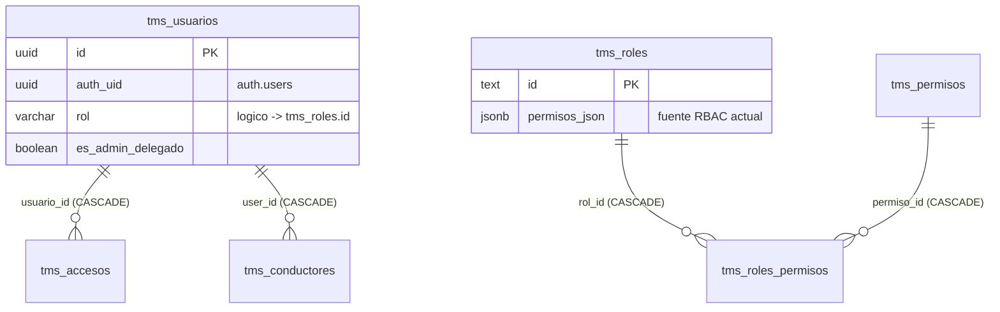
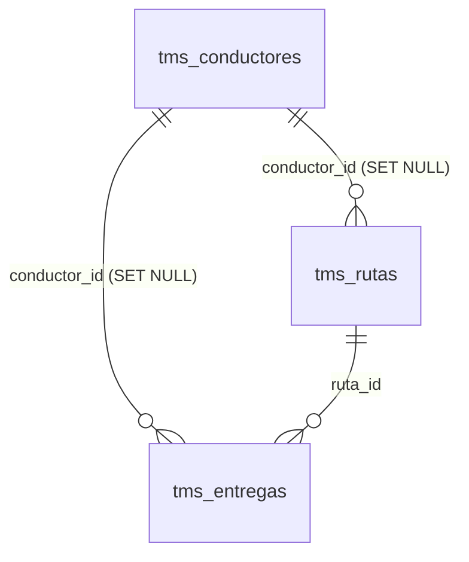
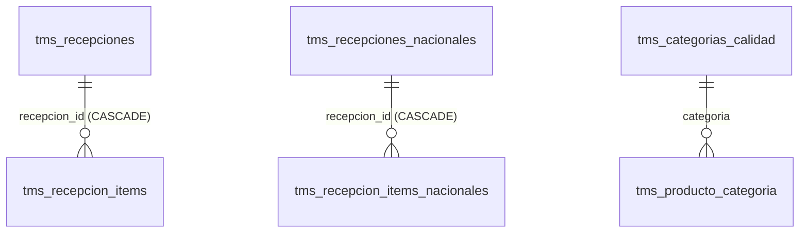
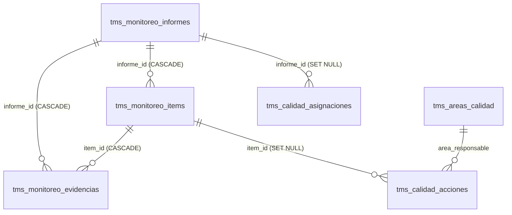
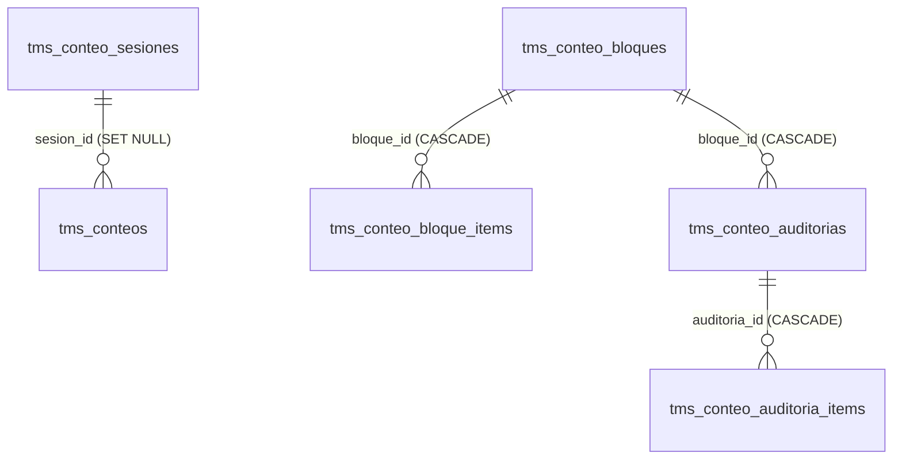
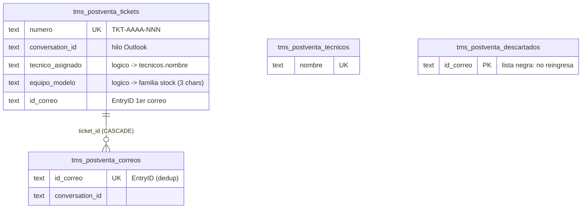

# Diagrama y Auditoría de la Base de Datos — CCO_PTM

**Proyecto Supabase:** `WMS-CCO-PTM` (`vtrtyzbgpsvqwbfoudaf`) · **Auditado:** 2026-07-09 (BD live)
**Alcance:** 69 tablas `public` (todas con RLS ON) · 95 funciones `public` + 1 `private` · 5 Edge Functions · 117 lints revisados (`get_advisors`).

> Cómo leer este documento: los diagramas Mermaid muestran las **FKs reales** (línea `||--o{`).
> Muchas conexiones del sistema son **relaciones lógicas por texto** (códigos del ERP, nombres),
> sin FK a propósito — están listadas en §3. Los hallazgos y su estado, en §6.

---

## 1. Módulos y sus tablas

| Módulo | Tablas | Filas (2026-07-09) |
|---|---|---|
| Núcleo / RBAC | `tms_usuarios`, `tms_roles`, `tms_permisos`, `tms_roles_permisos`, `tms_accesos`, `tms_usuarios_activos`, `tms_modules_config`, `tms_notificaciones`, `tms_auditoria`, `tms_tickets` | usuarios 15 · auditoría 98.669 |
| Stock / WMS | `tms_partidas`, `tms_series`, `tms_inventario_resumen`, `tms_matriz_codigos`, `wms_ubicaciones`, `wms_layout`, `tms_farmapack`, `tms_pesos`, `tms_fichas_imagenes`, `tms_producto_categoria`, `tms_inventario_general` | partidas 4.783 · series 5.074 · ubicaciones 3.716 |
| Inbound | `tms_recepciones`(+`_items`), `tms_recepciones_nacionales`(+`_items`), `tms_cubicaje_historial`, `tms_historial_cargas` | items 2.291 |
| Outbound / NV | `tms_nv_diarias`, `tms_nv_eliminadas`, `tms_control_despacho`, `tms_errores_picking`, `tms_mediciones_tiempos` | NV 3.009 · despachos 4.066 |
| TMS transporte | `tms_conductores`, `tms_rutas`, `tms_entregas`, `tms_direcciones` | direcciones 8.102 |
| Calidad | `tms_calidad_tareas`, `tms_monitoreo_informes`(+`_items`, `_evidencias`), `tms_calidad_acciones`, `tms_calidad_asignaciones`, `tms_calidad_flags`, `tms_categorias_calidad`, `tms_areas_calidad`, `tms_bodegas_softland` | — |
| Conteo Cíclico | `tms_conteo_sesiones`, `tms_conteos`, `tms_conteo_bloques`(+`_items`), `tms_conteo_auditorias`(+`_items`), `tms_conteo_proyecciones`, `tms_conteo_costos` | — |
| Post-Venta | `tms_postventa_tickets`, `tms_postventa_correos`, `tms_postventa_tecnicos`, `tms_postventa_descartados` | tickets 999 · correos 2.166 |
| Traspasos (em-il) | `tms_emil_sync`, `tms_emil_catalogo` | blobs (1 c/u) |
| ~~Muertas~~ (eliminadas en mig `053`) | ~~`wms_bloques(+3)`, `wms_cc_*(3)`, `wms_proyecciones`~~ | eliminadas 2026-07-09 (§6.4) |

---

## 2. Diagramas ER (FKs reales)

### 2.1 Núcleo / RBAC

> El RBAC vigente usa `tms_roles.permisos_json` (jsonb); `tms_roles_permisos` es el histórico normalizado.

### 2.2 TMS transporte

### 2.3 Inbound / Recepciones

### 2.4 Calidad (3 hitos + acciones)

> `tms_calidad_tareas` (checklists ingreso/salida) y `tms_calidad_flags` se enlazan por
> claves lógicas (`recepcion_id`, `codigo_producto`), no por FK — ver §3.

### 2.5 Conteo Cíclico

> El "stock del sistema" del conteo sale de `tms_partidas`/`tms_series` vía RPC
> `conteo_stock_sistema` (relación lógica por `codigo_producto`+`partida`/`serie`).

### 2.6 Post-Venta / Servicio Técnico

---

## 3. Relaciones LÓGICAS (por texto, sin FK — de diseño)

El sistema importa datos del ERP (Softland) y de correos; muchas uniones son por código/texto:

| Desde | Hacia | Clave | Dónde se usa |
|---|---|---|---|
| `tms_usuarios.rol` | `tms_roles.id` | texto | AuthContext, `_*_assert` |
| `tms_partidas` / `tms_series` / `tms_inventario_resumen` / `tms_nv_diarias` / `tms_matriz_codigos` | entre sí | `codigo_producto` (SKU ERP) | stock, picking, consultas |
| `tms_conteos.codigo_producto(+partida/serie)` | `tms_partidas`/`tms_series` | SKU+lote/serie | `conteo_stock_sistema`, conciliación |
| `tms_conteo_costos.codigo_producto` | conciliación | SKU | impacto valorizado |
| `tms_postventa_tickets.tecnico_asignado` | `tms_postventa_tecnicos.nombre` | nombre | derivar caso (catálogo editable) |
| `tms_postventa_tickets.equipo_modelo` | familia stock (`left(codigo_producto,3)`) | 3 chars | `pv_familias_stock()` |
| `tms_postventa_descartados.id_correo` | ingesta | EntryID | `ingesta_pv_correo` (bloquea reingreso) |
| `tms_calidad_tareas.recepcion_id` | `tms_recepciones(_nacionales)` | uuid sin FK (tipo-aware) | checklist hito 1/3 |
| `tms_calidad_flags.codigo_producto+partida` | stock | SKU+lote | estado de calidad vigente |
| `tms_calidad_acciones.bodega_destino` | `tms_bodegas_softland.codigo` | código ERP | dictamen |
| `tms_calidad_acciones.ticket_postventa` | `tms_postventa_tickets.numero` | folio TKT | acción → ticket ST (mig 055) |
| `tms_postventa_tickets.accion_folio` / `.informe_numero` | `tms_calidad_acciones.folio` / `tms_monitoreo_informes.numero` | folios | ticket derivado de Calidad con informe adjunto |
| `tms_calidad_acciones.referencia` | traspaso/correo (em-il) | texto libre | Inventario registra la ejecución |
| `wms_ubicaciones.codigo` ↔ `wms_layout` | mapa bodega | código ubicación | heatmap/putaway |

> Estas uniones son intencionales (datos re-importados semanalmente desde el ERP; una FK dura
> rompería las cargas). La integridad se protege en las RPCs y con triggers de normalización
> (migraciones 044/045).

---

## 4. Funciones verificadas (95 en `public` + 1 en `private`)

**Patrón de seguridad del proyecto:** escrituras vía RPC `SECURITY DEFINER` con `search_path`
fijo, gate interno por `_*_assert*` (usuario activo + permisos jsonb del rol) y
`REVOKE anon` — la lectura va por RLS `authenticated`.

**Verificación 2026-07-09 (post-migración 052):**
- ✅ **0 funciones SECURITY DEFINER ejecutables por `anon`** (única excepción intencional: `verificar_certificado`, verificación pública por QR).
- ✅ **0 funciones con `search_path` mutable** (7 corregidas en la 052, incl. `private.calidad_firma_mensaje` que firma HMAC).
- ✅ Todas las RPC de negocio tienen gate interno verificado en BD con pruebas de flujo (ver changelogs v1.14–v1.16).

| Módulo | RPCs de negocio (SECURITY DEFINER + gate) | Helpers / triggers |
|---|---|---|
| RBAC/Admin | `create_auth_user`, `update_auth_password`, `is_admin`, `get_user_role` | `tms_audit_row`, `tms_usuarios_freeze_privileged` (sin acceso API) |
| Stock/Import | `bulk_upsert`, `search_batches`, `search_productos`, `fuzzy_search`, `prepare_nv_import`, `sync_deleted_items`, `batch_update_nv_estado`, `clean_operational_data`, `buscar_direcciones`, `get_ficha_producto` | `_tms_partidas_norm_partida`, `_tms_series_norm_serie` (triggers dedup lote/serie) |
| Outbound legacy | `wms_move_stock` (cola offline PDA), `get_dashboard_kpis` (+`mv_dashboard_kpis`) | `update_nv_updated_at`, `update_updated_at_column` |
| Calidad | `crear/actualizar_informe_monitoreo`, `monitoreo_dictaminar/candidatos/next_numero/marcar_preliminar`, `guardar_checklist_ingreso`, `crear_tarea_checklist_ingreso/salida(_manual)`, `firmar_certificado`, `verificar_certificado` (pública), `crear/resolver/anular_accion_calidad`, `crear/resolver/anular/eliminar_asignacion_calidad`, `eliminar_tarea_calidad`, `calidad_categorias_tarea`, `calidad_lotes_series`, `set_categoria_producto`, `trazabilidad_producto`, `guardar/eliminar_bodega_softland`, `can_manage_calidad/fichas` | `_monitoreo_assert_permiso`, `_monitoreo_insert_items`, `_calidad_assert_admin`, `_asignacion_calidad_assert_permiso`, `clasificar_producto`, `categoria_efectiva`, `set_categoria_item` (trigger), `private.calidad_firma_mensaje` (HMAC) |
| Conteo Cíclico | `crear/cerrar_conteo_sesion`, `registrar/editar/eliminar_conteo`, `crear/editar_conteo_bloque`, `agregar/eliminar_conteo_bloque_item`, `registrar_conteo_auditoria`, `conteo_conciliacion`, `conteo_ajuste_erp`, `conteo_stock_sistema`, `guardar/eliminar_conteo_proyeccion`, `guardar_conteo_costo` | `_conteo_assert`, `_conteo_user`, `_conteo_es_super`, `_conteo_estado` |
| Post-Venta | `crear_pv_ticket`, `actualizar_pv_ticket`, `eliminar_pv_ticket`, `ingesta_pv_correo`, `eliminar_pv_correo`, `pv_correos_ticket`, `pv_dashboard`, `pv_familias_stock`, `siguiente_pv_numero`, `guardar/eliminar_pv_tecnico` | `_pv_assert` (acepta `service_role` para las Edge Functions) |
| Notificaciones | — | `notify_new_ticket`, `notify_ticket_update` (triggers → Edge) |
| ~~Muertas~~ | ~~`wms_reserve_stock`, `get_fefo_allocation`, `fn_auto_complete_picking`, `fn_trigger_replenishment`~~ — eliminadas en mig `053` (§6.4) | |

## 5. Edge Functions (5 activas)

| Función | verify_jwt | Rol |
|---|---|---|
| `postventa-inbox` v5 | off (token `PV_INGEST_TOKEN`, header `X-API-Key`) | ingesta correos macro Outlook → `ingesta_pv_correo` |
| `postventa-extractor` v2 | on | extractor M365/Graph (alternativa; requiere secrets GRAPH_*) |
| `notify-ticket` v6 / `notify-ticket-update` v4 | off | push FCM de tickets TI (via triggers `notify_*`) |
| `notify-inventario` v2 | on | notificaciones de inventario |

---

## 6. Hallazgos de la auditoría y estado

### 6.1 Corregido en la migración `052` ✅
1. **11 funciones SECURITY DEFINER ejecutables por `anon`** — filtraban datos sin sesión
   (`pv_dashboard` exponía tickets con clientes; `conteo_conciliacion`/`conteo_stock_sistema`
   exponían stock valorizado). → `REVOKE anon/PUBLIC` (se conserva `verificar_certificado`).
2. **7 funciones con `search_path` mutable** → fijado `search_path=public`
   (incl. `private.calidad_firma_mensaje`, que genera la firma HMAC de certificados).
3. **`mv_dashboard_kpis` legible por `anon` vía API** → `REVOKE SELECT FROM anon`.

### 6.2 Aceptado por diseño (documentado)
- **69 RPCs SECURITY DEFINER ejecutables por `authenticated`**: es el patrón del proyecto — el
  gate real está DENTRO de cada RPC (`_*_assert` + permisos del rol). Verificado por pruebas.
- **`verificar_certificado` pública**: el QR del certificado debe validar sin sesión.
- **Relaciones lógicas sin FK** (§3): los datos del ERP se recargan semanalmente.

### 6.3 Riesgo conocido pendiente (no bloqueante)
- **27 tablas con política RLS `USING (true)`** para `authenticated` (ledger interno
  compartido: stock, NV, despachos…). Cualquier usuario logueado puede leer/escribir esas
  tablas vía API aunque la UI lo esconda. Mitigación futura: mover escrituras a RPC + política
  de INSERT/UPDATE restrictiva. **Decisión pendiente del negocio** (afecta a las cargas masivas).
- **Protección de contraseñas filtradas (HIBP) desactivada** en Auth → se activa a mano en
  Dashboard → Authentication → Settings (no configurable por SQL).

### 6.4 Limpieza ejecutada ✅ (migración `053`, aprobada por el usuario 2026-07-09)
- **8 tablas muertas eliminadas**: `wms_bloques(+3)`, `wms_cc_*(3)`, `wms_proyecciones` —
  tenían 0 filas y 0 referencias (restos del primer intento del Conteo Cíclico; el módulo vivo
  usa `tms_conteo_*`). Verificado en vivo justo antes del DROP.
- **4 funciones muertas eliminadas**: `wms_reserve_stock`, `get_fefo_allocation`,
  `fn_auto_complete_picking`, `fn_trigger_replenishment` — sin llamadas ni triggers.
- **Conservado (vivo, verificado por referencias)**: `wms_layout`, `wms_ubicaciones`,
  `wms_move_stock` (cola offline del PDA), `get_dashboard_kpis`+`mv_dashboard_kpis` (Dashboard),
  `fuzzy_search` (Estado N.V.), `batch_update_nv_estado` (N.V.), `tms_inventario_general`
  (DataImport). El esquema queda en **61 tablas**, todas vivas y conectadas.
